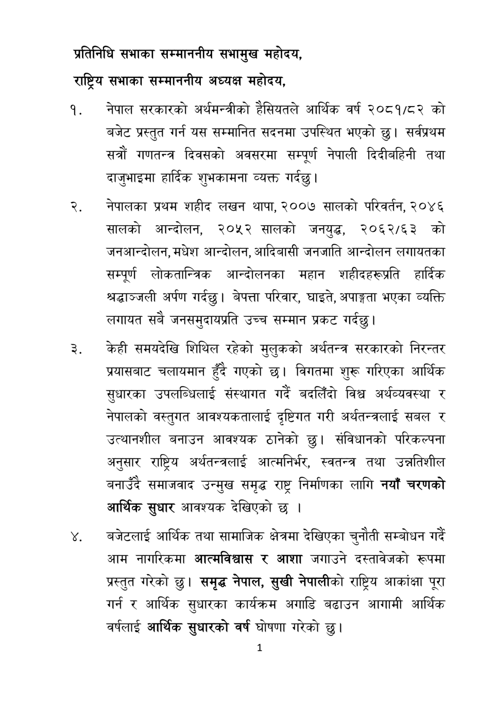

# Page 2 QA

## Rendered page


## Extracted text

```text
प्रतिनिधि सभाका सम्माननीय सभामुख महोदय,
राष्ट्रिय सभाका सम्माननीय अध्यक्ष महोदय,
नेपाल सरकारको अर्थमन्त्रीको हैसियतले आर्थिक वर्ष २०८१/८२ को बजेट प्रस्तुत गर्न यस सम्मानित सदनमा उपस्थित भएको छु। सर्वप्रथम सत्रौं गणतन्त्र दिवसको अवसरमा सम्पूर्ण नेपाली दिदीबहिनी तथा दाजुभाइमा हार्दिक शुभकामना व्यक्त गर्दछु।
नेपालका प्रथम शहीद लखन थापा, २००७ सालको परिवर्तन, २०४६ सालको आन्दोलन, २०५२ सालको जनयुद्ध, २०६२/६३ को जनआन्दोलन, मधेश आन्दोलन, आदिबासी जनजाति आन्दोलन लगायतका सम्पूर्ण लोकतान्त्रिक आन्दोलनका महान शहीदहरूप्रति हार्दिक श्रद्धाञ्जली अर्पण गर्दछु। बेपत्ता परिवार, घाइते, अपाङ्गता भएका व्यक्ति लगायत सबै उच्च सम्मान प्रकट
जनसमुदायप्रति गर्दछु।
केही समयदेखि शिथिल रहेको मुलुकको अर्थतन्त्र सरकारको निरन्तर प्रयासबाट चलायमान हुँदै गएको | विगतमा शुरू गरिएका आर्थिक सुधारका उपलब्धिलाई संस्थागत गर्दै बदलिँदो विश्व अर्थव्यवस्था र नेपालको वस्तुगत आवश्यकतालाई दृष्टिगत गरी अर्थतन्त्रलाई सबल र उत्थानशील बनाउन आवश्यक ठानेको छु। संविधानको परिकल्पना अनुसार राष्ट्रिय अर्थतन्त्रलाई आत्मनिर्भर, स्वतन्त्र तथा उन्नतिशील बनाउँदै समाजवाद उन्मुख समृद्ध राष्ट्र निर्माणका लागि नयाँ चरणको आर्थिक सुधार आवश्यक देखिएको छ।
बजेटलाई आर्थिक तथा सामाजिक क्षेत्रमा देखिएका चुनौती सम्बोधन गर्दै आम नागरिकमा आत्मविश्वास र आशा जगाउने दस्तावेजको रूपमा प्रस्तुत गरेको छु। समृद्ध नेपाल, सुखी नेपालीको राष्ट्रिय आकांक्षा पूरा गर्न र आर्थिक सुधारका कार्यक्रम अगाडि बढाउन आगामी आर्थिक वर्षलाई आर्थिक सुधारको वर्ष घोषणा गरेको छु।
१
```

## Flags
- None
