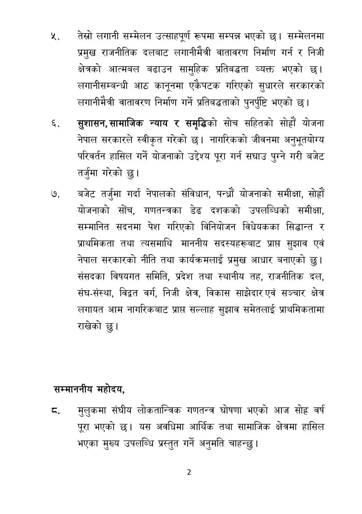

# Page 3 QA

## Rendered page


## Extracted text

```text
तेस्रो लगानी सम्मेलन उत्साहपूर्ण रूपमा सम्पन्न भएको छ। सम्मेलनमा प्रमुख राजनीतिक दलबाट लगानीमैत्री वातावरण निर्माण गर्न र निजी क्षेत्रको आत्मबल बढाउन सामुहिक प्रतिबद्धता व्यक्त भएको छ। लगानीसम्बन्धी आठ कानूनमा एकैपटक गरिएको सुधारले सरकारको लगानीमैत्री वातावरण निर्माण गर्ने प्रतिबद्धताको पुनर्पृष्टि भएको छ।
सुशासन, सामाजिक न्याय र समृद्धिको सोच सहितको सोह्रौं योजना नेपाल सरकारले स्वीकृत गरेको छ। नागरिकको जीवनमा अनुभूतयोग्य परिवर्तन हासिल गर्ने योजनाको उद्देश्य पूरा गर्न सघाउ पुग्ने गरी बजेट तर्जुमा गरेको छु।
बजेट तर्जुमा गर्दा नेपालको संविधान, पन्ध्रौं योजनाको समीक्षा, सोह्रौं योजनाको सोँच, गणतन्त्रका डेढ दशकको उपलब्धिको समीक्षा, सम्मानित सदनमा पेश गरिएको विनियोजन विधेयकका सिद्धान्त र प्राथमिकता तथा त्यसमाथि माननीय सदस्यहरूबाट प्राप्त सुझाव एवं नेपाल सरकारको नीति तथा कार्यक्रमलाई प्रमुख आधार बनाएको छु। संसदका विषयगत समिति, प्रदेश तथा स्थानीय तह, राजनीतिक दल, संघ-संस्था, विद्वत वर्ग, निजी क्षेत्र, विकास साझेदार एवं सञ्चार क्षेत्र लगायत आम नागरिकबाट प्राप्त सल्लाह सुझाव समेतलाई प्राथमिकतामा राखेको छु।
सम्माननीय महोदय,
मुलुकमा संघीय लोकतान्त्रिक गणतन्त्र घोषणा भएको आज सोह्र वर्ष पूरा भएको | यस अवधिमा आर्थिक तथा सामाजिक क्षेत्रमा हासिल भएका मुख्य उपलब्धि प्रस्तुत गर्ने अनुमति चाहन्छु |
```

## Flags
- None
