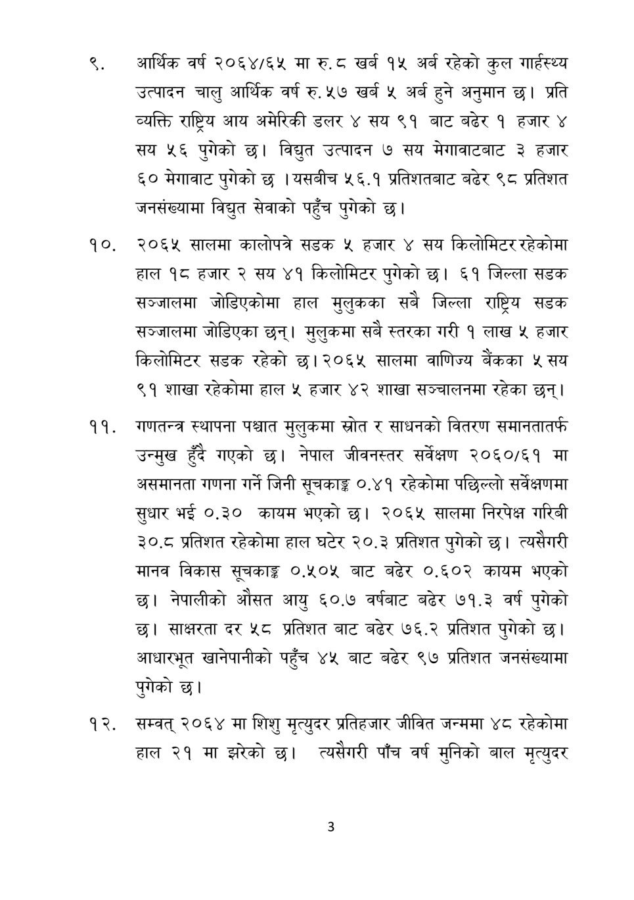

# Page 4 QA

## Rendered page


## Extracted text

```text
आर्थिक वर्ष २०६४/६५ मा रु. ८ खर्ब १५ अर्ब रहेको कुल गार्हस्थ्य उत्पादन चालु आर्थिक वर्ष रु. ५७ खर्ब ५ अर्ब हुने अनुमान छ। प्रति व्यक्ति राष्ट्रिय आय अमेरिकी डलर ४ सय ९१ बाट बढेर १ हजार ४ सय ५६ पुगेको छ। विद्युत उत्पादन ७ सय मेगावाटबाट ३ हजार ६० मेगावाट पुगेको छ। यसबीच ५६.१ प्रतिशतबाट बढेर ९८ प्रतिशत जनसंख्यामा विद्युत सेवाको पहुँच पुगेको छ।
२०६५ सालमा कालोपत्रे सडक ५ हजार सय किलोमिटर रहेकोमा हाल १८ हजार २ सय ४१ किलोमिटर पुगेको छ। ६१ जिल्ला सडक सञ्जालमा जोडिएकोमा हाल मुलुकका सबै जिल्ला राष्ट्रिय सडक सञ्जालमा जोडिएका छन्‌। मुलुकमा सबै स्तरका गरी १ लाख ५ हजार किलोमिटर सडक रहेको छ। २०६५ सालमा वाणिज्य बैंकका ५ सय ९१ शाखा रहेकोमा हाल ५ हजार ४२ शाखा सञ्चालनमा रहेका छन्‌।
गणतन्त्र स्थापना पश्चात मुलुकमा स्रोत र साधनको वितरण समानतातर्फ उन्मुख हुँदै गएको छ। नेपाल जीवनस्तर सर्वेक्षण २०६०/६१ मा असमानता गणना गर्ने जिनी सूचकाङ्क ०.४१ रहेकोमा पछिल्लो सर्वेक्षणमा सुधार भई ०.३० कायम भएको | २०६५ सालमा निरपेक्ष गरिवी ३०.८ प्रतिशत रहेकोमा हाल घटेर २०. ३ प्रतिशत पुगेको छ। त्यसैगरी मानव विकास सूचकाङ्ग ०.५०५ बाट बढेर ०.६००२ कायम भएको छ। नेपालीको औसत आयु ६०.७ वर्षबाट बढेर ७१.३ वर्ष पुगेको छ। साक्षरता दर ५८ प्रतिशत बाट बढेर ७६.२ प्रतिशत पुगेको छ। आधारभूत खानेपानीको पहुँच ४५ बाट बढेर ९७ प्रतिशत जनसंख्यामा पुगेको छ।
सम्वत्‌ २०६४ मा शिशु मृत्युदर प्रतिहजार जीवित जन्ममा ४८ रहेकोमा हाल २१ मा झरेको छ। त्यसैगरी पाँच वर्ष मुनिको बाल मृत्युदर
```

## Flags
- None
