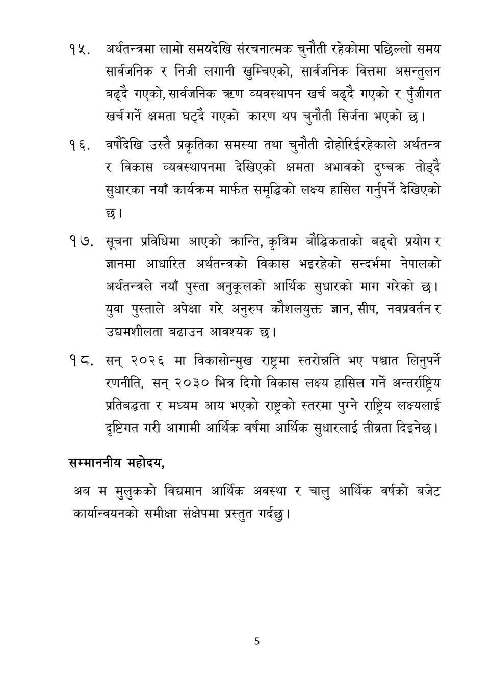

# Page 6 QA

## Rendered page


## Extracted text

```text
अर्थतन्त्रमा लामो समयदेखि संरचनात्मक चुनौती रहेकोमा पछिल्लो समय सार्वजनिक र निजी लगानी खुम्चिएको, सार्वजनिक वित्तमा असन्तुलन बढ्दै गएको, सार्वजनिक व्यवस्थापन खर्च बढ्दै गएको र पुँजीगत खर्चगर्न क्षमता घट्दै गएको कारण थप चुनौती सिर्जना भएको छ।
वर्षदेखि उस्तै प्रकृतिका समस्या तथा चुनौती दोहोरिईरहेकाले अर्थतन्त्र र विकास व्यवस्थापनमा देखिएको क्षमता अभावको दुष्चक्र तोड्दै सुधारका नयाँ कार्यक्रम मार्फत समृद्धिको लक्ष्य हासिल गर्नुपर्ने देखिएको छ।
सूचना प्रविधिमा आएको कान्ति, कृत्रिम बौद्धिकताको बढ्दो प्रयोग र ज्ञानमा आधारित अर्थतन्त्रको विकास भइरहेको सन्दर्भमा नेपालको अर्थतन्त्रले नयाँ पुस्ता अनुकूलको आर्थिक सुधारको माग गरेको छ। युवा पुस्ताले अपेक्षा गरे अनुरुप कोशलयुक्त ज्ञान, सीप, नवप्रवर्तन र उद्यमशीलता बढाउन आवश्यक छ।
सन्‌ २०२६ मा विकासोन्मुख राष्ट्रमा स्तरोन्नति भए पश्चात लिनुपर्ने रणनीति, सन्‌ २०३० भित्र दिगो विकास लक्ष्य हासिल गर्ने अन्तर्राष्ट्रिय प्रतिबद्धता र मध्यम आय भएको राष्ट्रको स्तरमा पुग्ने राष्ट्रिय लक्ष्यलाई दृष्टिगत गरी आगामी आर्थिक वर्षमा आर्थिक सुधारलाई तीब्रता दिइनेछ |
सम्माननीय
महोदय,
अब म मुलुकको विद्यमान आर्थिक अवस्था र चालु आर्थिक वर्षको बजेट कार्यान्वयनको समीक्षा संक्षेपमा प्रस्तुत गर्दछु |
```

## Flags
- None
