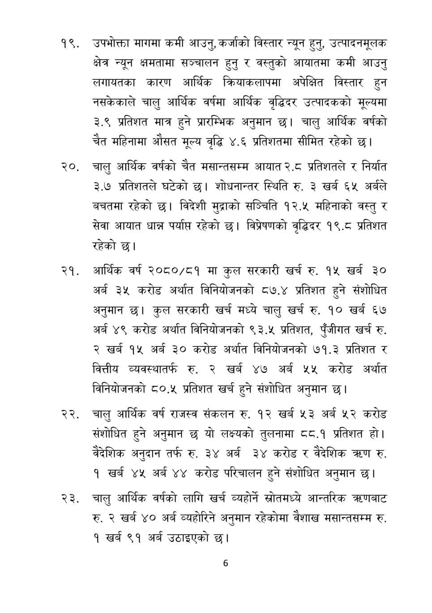

# Page 7 QA

## Rendered page


## Extracted text

```text
उपभोक्ता मागमा कमी आउनु, कर्जाको विस्तार न्यून हुनु, उत्पादनमूलक क्षेत्र न्यून क्षमतामा सञ्चालन हुनु र वस्तुको आयातमा कमी आउनु लगायतका कारण आर्थिक क्रियाकलापमा अपेक्षित विस्तार हुन नसकेकाले चालु आर्थिक वर्षमा आर्थिक वृद्धिदर उत्पादकको मूल्यमा ३.९ प्रतिशत मात्र हुने प्रारम्भिक अनुमान छ। चालु आर्थिक वर्षको चेत महिनामा औसत मूल्य वृद्धि ४.६ प्रतिशतमा सीमित रहेको छ।
२०, चालु आर्थिक वर्षको चैत मसान्तसम्म आयात २.८ प्रतिशतले र निर्यात ३.७ प्रतिशतले घटेको छ। शोधनान्तर स्थिति रु. ३ खर्ब ६५ अर्बले बचतमा रहेको छ। विदेशी मुद्राको सञ्चिति १२.५ महिनाको वस्तु र सेवा आयात धान्न पर्याप रहेको छ। विप्रेषणको वृद्धिदर १९.८ प्रतिशत रहेको छ।
आर्थिक वर्ष २०८०/८१ मा कुल सरकारी खर्च रु. १५ खर्ब ३० अर्ब ३५ करोड अर्थात विनियोजनको ८७.४ प्रतिशत हुने संशोधित अनुमान छ। कुल सरकारी खर्च मध्ये चालु खर्च रु. १० खर्ब ६७ अर्ब ४९ करोड अर्थात विनियोजनको ९३.५ प्रतिशत, पुँजीगत खर्च रु. २ खर्ब १५ अर्ब ३० करोड अर्थात विनियोजनको ७१.३ प्रतिशत र वित्तीय व्यवस्थातर्फ रु. २ खर्ब ४७ अर्ब ५५ करोड अर्थात विनियोजनको ८०.५ प्रतिशत खर्च हुने संशोधित अनुमान |
चालु आर्थिक वर्ष राजस्व संकलन रु. १२ खर्ब ५३ अर्ब ५२ करोड संशोधित हुने अनुमान छ यो लक्ष्यको तुलनामा ८८.१ प्रतिशत हौ। वैदेशिक अनुदान तर्फ रु. ३४ अर्ब ३४ करोड र वैदेशिक रु. १ खर्ब ४५ अर्ब ४४ करोड परिचालन हुने संशोधित अनुमान छ।
चालु आर्थिक वर्षको लागि खर्च व्यहोर्ने स्रोतमध्ये आन्तरिक त्रहणबाट रु. २ खर्ब ४० अर्ब व्यहोरिने अनुमान रहेकोमा वैशाख मसान्तसम्म रु. १ खर्ब ९१ अर्ब उठाइएको छ।
६
```

## Flags
- None
