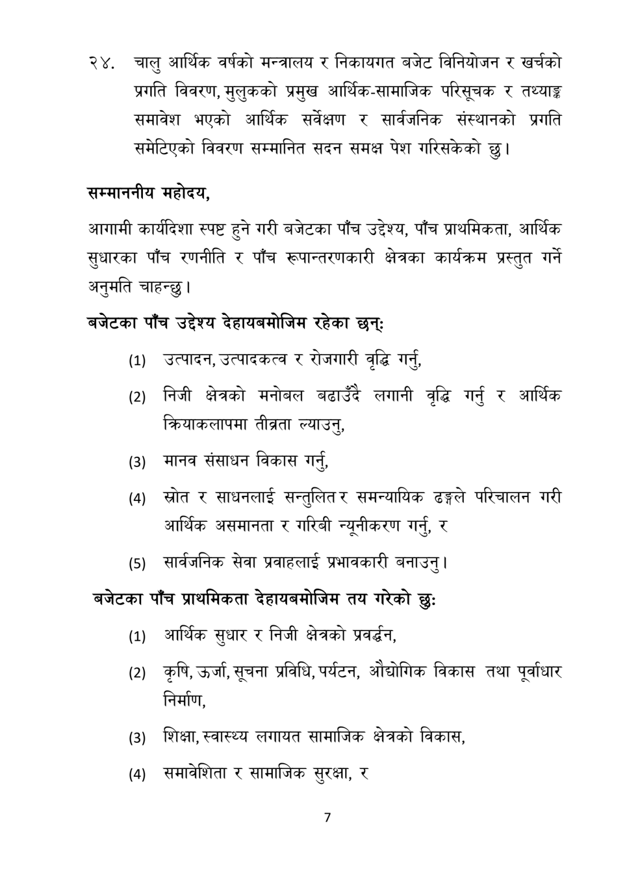

# Page 8 QA

## Rendered page


## Extracted text

```text
चालु आर्थिक वर्षको मन्त्रालय र निकायगत बजेट विनियोजन र खर्चको प्रगति विवरण, मुलुकको प्रमुख आर्थिक-सामाजिक परिसूचक र तथ्याङ्क समावेश भएको आर्थिक सर्वेक्षण र सार्वजनिक संस्थानको प्रगति समेटिएको विवरण सम्मानित सदन समक्ष पेश गरिसकेको छु।
सम्माननीय महोदय,
आगामी कार्यदिशा स्पष्ट हुने गरी बजेटका पाँच उद्देश्य, पाँच प्राथमिकता, आर्थिक सुधारका पाँच रणनीति र पाँच रूपान्तरणकारी क्षेत्रका कार्यक्रम प्रस्तुत गर्ने अनुमति चाहन्छु।
बजेटका पाँच उद्देश्य देहायबमोजिम रहेका छन्‌ः
उत्पादन, उत्पादकत्व र रोजगारी वृद्धि गर्न,
निजी क्षेत्रको मनोबल बढाउँदै लगानी वृद्धि गर्नु र आर्थिक क्रियाकलापमा तीब्रता ल्याउनु,
मानव संसाधन विकास गर्नु,
स्रोत र साधनलाई सन्तुलित र समन्यायिक ढङ्गले परिचालन गरी आर्थिक असमानता र गरिबी न्यूनीकरण गर्नु, र
सार्वजनिक सेवा प्रवाहलाई प्रभावकारी बनाउनु |
बजेटका पाँच प्राथमिकता देहायबमोजिम तय गरेको छुः
आर्थिक सुधार र निजी क्षेत्रको प्रवर्द्धन,
कृषि, उर्जा, सूचना प्रविधि, पर्यटन, औद्योगिक विकास तथा पूर्वाधार निर्माण,
शिक्षा, स्वास्थ्य लगायत सामाजिक क्षेत्रको विकास,
समावेशिता र सामाजिक सुरक्षा, र
७
```

## Flags
- None
