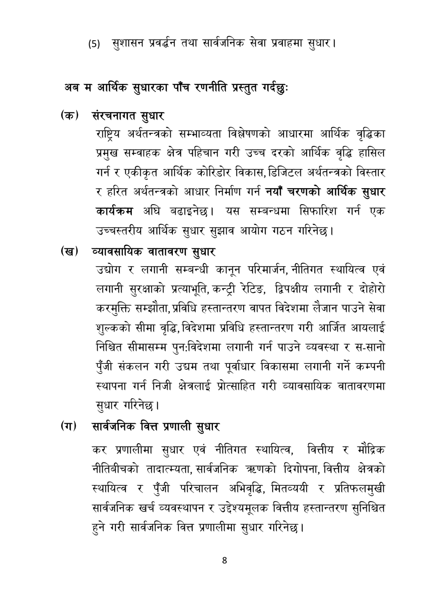

# Page 9 QA

## Rendered page


## Extracted text

```text
(५) सुशासन प्रवर्धन तथा सार्वजनिक सेवा प्रवाहमा सुधार |
अब म आर्थिक सुधारका पाँच रणनीति प्रस्तुत गर्दछुः
(क) संरचनागत सुधार
राष्ट्रिय अर्थतन्त्रको सम्भाव्यता विश्लेषणको आधारमा आर्थिक वृद्धिका प्रमुख सम्वाहक क्षेत्र पहिचान गरी उच्च दरको आर्थिक वृद्धि हासिल गर्न र एकीकृत आर्थिक कोरिडोर विकास, डिजिटल अर्थतन्त्रको विस्तार र हरित अर्थतन्त्रको आधार निर्माण गर्न नयाँ चरणको आर्थिक सुधार कार्यक्रम अघि बढाइनेछ। यस सम्बन्धमा सिफारिश गर्न एक उच्चस्तरीय आर्थिक सुधार सुझाव आयोग गठन गरिनेछ।
(ख) व्यावसायिक वातावरण सुधार
उद्योग र लगानी सम्बन्धी कानून परिमार्जन, नीतिगत स्थायित्व एवं लगानी सुरक्षाको प्रत्याभूति, कन्ट्री रेटिङ, द्विपक्षीय लगानी र दोहोरो करमुक्ति सम्झौता, प्रविधि हस्तान्तरण वापत विदेशमा लैजान पाउने सेवा शुल्कको सीमा वृद्धि, विदेशमा प्रविधि हस्तान्तरण गरी आर्जित आयलाई निश्चित सीमासम्म पुन:विदेशमा लगानी गर्न पाउने व्यवस्था र स-सानो पुँजी संकलन गरी उद्यम तथा पूर्वाधार विकासमा लगानी गर्ने कम्पनी स्थापना गर्न निजी क्षेत्रलाई प्रोत्साहित गरी व्यावसायिक वातावरणमा सुधार गरिनेछ |
(ग) सार्वजनिक वित्त प्रणाली सुधार
कर प्रणालीमा सुधार एवं नीतिगत स्थायित्व, वित्तीय र मौद्रिक नीतिबीचको तादात्म्यता, सार्वजनिक त्रणको दिगोपना, वित्तीय क्षेत्रको स्थायित्व र पुँजी परिचालन अभिवृद्धि, मितव्ययी र प्रतिफलमुखी सार्वजनिक खर्च व्यवस्थापन र उद्देश्यमूलक वित्तीय हस्तान्तरण सुनिश्चित हुने गरी सार्वजनिक वित्त प्रणालीमा सुधार गरिनेछ |
```

## Flags
- None
