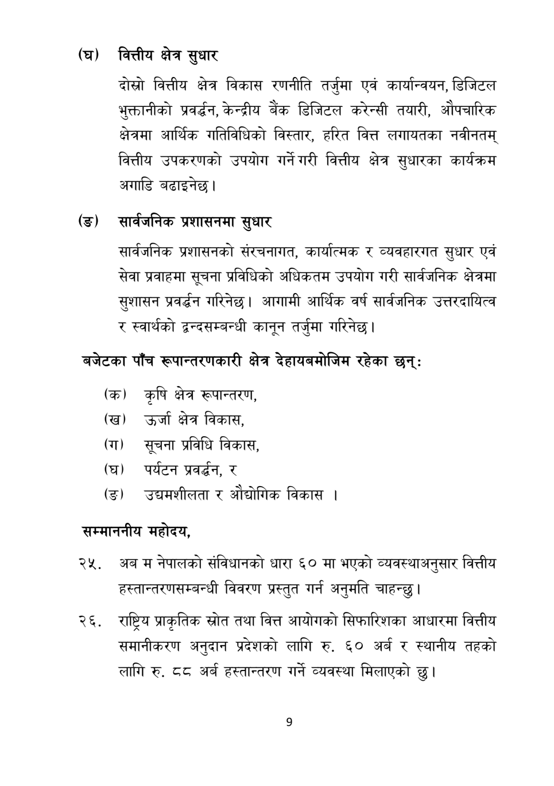

# Page 10 QA

## Rendered page


## Extracted text

```text
(घ) वित्तीय क्षेत्र
सुधार
दोस्रो वित्तीय क्षेत्र विकास रणनीति तर्जुमा एवं कार्यान्वयन, डिजिटल भुक्तानीको प्रवर्द्धन, केन्द्रीय बैंक डिजिटल करेन्सी तयारी, औपचारिक क्षेत्रमा आर्थिक गतिविधिको विस्तार, हरित वित्त लगायतका नवीनतम्‌ वित्तीय उपकरणको उपयोग गर्ने गरी वित्तीय क्षेत्र सुधारका कार्यक्रम अगाडि बढाइनेछ।
सार्वजनिक प्रशासनमा सुधार
सार्वजनिक प्रशासनको संरचनागत, कार्यात्मक र व्यवहारगत सुधार एवं सेवा प्रवाहमा सूचना प्रविधिको अधिकतम उपयोग गरी सार्वजनिक क्षेत्रमा सुशासन प्रवर्धन गरिनेछ। आगामी आर्थिक वर्ष सार्वजनिक उत्तरदायित्व र स्वार्थको द्वन्दसम्बन्धी कानून तर्जुमा गरिनेछ |
बजेटका पाँच रूपान्तरणकारी क्षेत्र देहायबमोजिम रहेका छन्‌:
(क) कृषि क्षेत्र रूपान्तरण,
(ख) उर्जा क्षेत्र विकास,
(ग) सूचना प्रविधि विकास,
(घ) पर्यटन प्रवर्धन, र
(ङ) उद्यमशीलता र औद्योगिक विकास।
सम्माननीय महोदय,
अब म नेपालको संविधानको धारा ६० मा भएको व्यवस्थाअनुसार वित्तीय हस्तान्तरणसम्बन्धी विवरण प्रस्तुत गर्न अनुमति चाहन्छु।
राष्ट्रिय प्राकृतिक स्रोत तथा वित्त आयोगको सिफारिशका आधारमा वित्तीय समानीकरण अनुदान प्रदेशको लागि रु. ६० अर्ब र स्थानीय तहको लागि रु. ठव अर्ब हस्तान्तरण गर्ने व्यवस्था मिलाएको |
```

## Flags
- None
