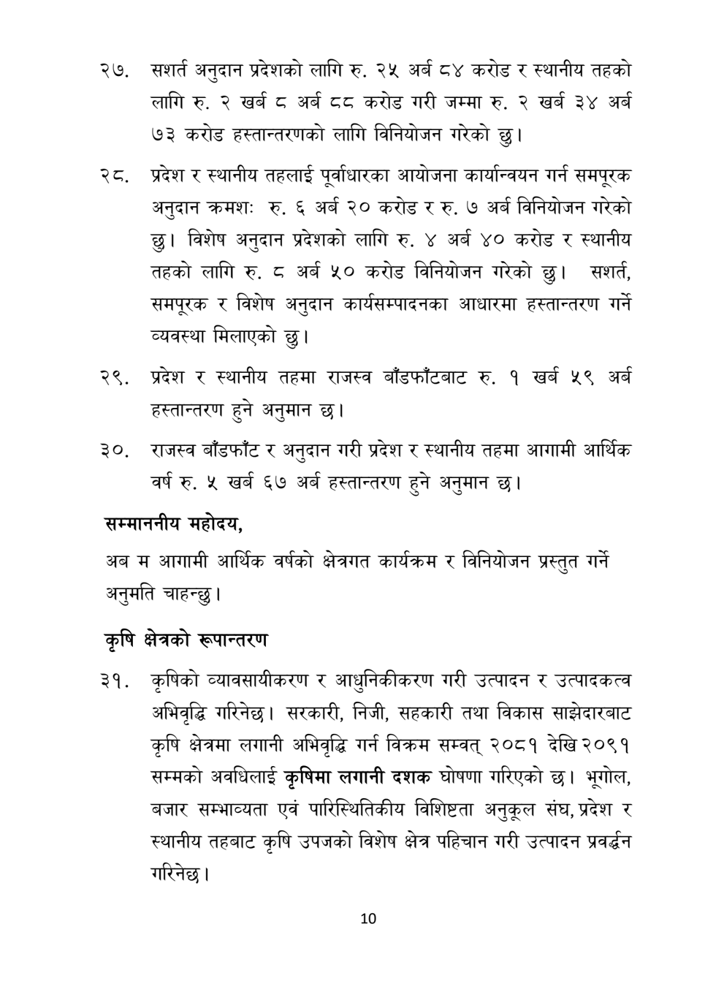

# Page 11 QA

## Rendered page


## Extracted text

```text
अनुदान प्रदेशको लागि रु. २५ अर्ब ८४ करोड र स्थानीय तहको लागि रु. २ खर्ब ८ अर्ब दद करोड गरी जम्मा रु. २ खर्ब ३४ अर्ब ७३ करोड हस्तान्तरणको लागि विनियोजन गरेको छु।
प्रदेश र स्थानीय तहलाई पूर्वाधारका आयोजना कार्यान्वयन गर्न समपूरक अनुदान क्रमशः रु. अर्ब २० करोड र रु. ७ अर्ब विनियोजन गरेको छु। विशेष अनुदान प्रदेशको लागि रु. ४ अर्ब ४० करोड र स्थानीय तहको लागि रु. ८ अर्ब ५० करोड विनियोजन गरेको छु। सञशार्त, समपूरक र विशेष अनुदान कार्यसम्पादनका आधारमा हस्तान्तरण गर्ने व्यवस्था मिलाएको छु।
प्रदेश र स्थानीय तहमा राजस्व बाँडफाँटबाट रु. १ खर्ब ५९ अर्ब हस्तान्तरण हुने अनुमान छ।
राजस्व बाँडफाँट र अनुदान गरी प्रदेश र स्थानीय तहमा आगामी आर्थिक वर्ष रु. ५ खर्ब ६७ अर्ब हस्तान्तरण हुने अनुमान छ।
सम्माननीय
महोदय,
अब म आगामी आर्थिक वर्षको क्षेत्रगत कार्यक्रम र विनियोजन प्रस्तुत गर्ने अनुमति चाहन्छु |
कृषि क्षेत्रको रूपान्तरण
कृषिको व्यावसायीकरण र आधुनिकीकरण गरी उत्पादन र उत्पादकत्व अभिवृद्धि गरिनेछ। सरकारी, निजी, सहकारी तथा विकास साझेदारबाट कृषि क्षेत्रमा लगानी अभिवृद्धि गर्न विक्रम सम्वत्‌ २०८१ देखि २०९१ सम्मको अवधिलाई कृषिमा लगानी दशक घोषणा गरिएको छ। भूगोल, बजार सम्भाव्यता एवं पारिस्थितिकीय विशिष्टता अनुकूल संघ, प्रदेश र स्थानीय तहबाट कृषि उपजको विशेष क्षेत्र पहिचान गरी उत्पादन प्रवर्धन गरिनेछ।
१०
```

## Flags
- None
