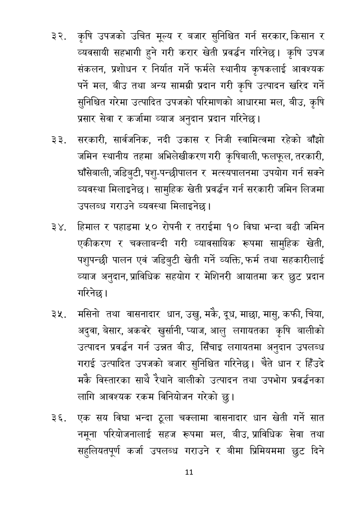

# Page 12 QA

## Rendered page


## Extracted text

```text
कृषि उपजको उचित मूल्य र बजार सुनिश्चित गर्न सरकार, किसान र व्यवसायी सहभागी हुने गरी करार खेती प्रवर्धन गरिनेछ। कृषि उपज संकलन, प्रशोधन र निर्यात गर्ने फर्मले स्थानीय कृषकलाई आवश्यक पर्ने मल, बीउ तथा अन्य सामग्री प्रदान गरी कृषि उत्पादन खरिद गर्ने सुनिश्चित गरेमा उत्पादित उपजको परिमाणको आधारमा मल, बीउ, कृषि प्रसार सेवा र कर्जामा व्याज अनुदान प्रदान गरिनेछ |
सरकारी, सार्वजनिक, नदी उकास र निजी स्वामित्वमा रहेको बाँझो जमिन स्थानीय तहमा अभिलेखीकरण गरी कृषिबाली, फलफूल, तरकारी, घाँसेबाली, जडिबुटी, पशु-पन्छीपालन र मत्स्यपालनमा उपयोग गर्न सक्ने व्यवस्था मिलाइनेछ। सामुहिक खेती प्रवर्द्धन गर्न सरकारी जमिन लिजमा उपलब्ध गराउने व्यवस्था मिलाइनेछ |
हिमाल र पहाडमा ५० रोपनी र तराईमा १० विघा भन्दा बढी जमिन एकीकरण र चक्लाबन्दी गरी व्यावसायिक रूपमा सामुहिक खेती, पशुपन्छी पालन एवं जडिबुटी खेती गर्ने व्यक्ति, फर्म तथा सहकारीलाई व्याज अनुदान, प्राविधिक सहयोग र मेशिनरी आयातमा कर छुट प्रदान गरिनेछ।
मसिनो तथा वासनादार धान, उखु, मकै, दूध, माछा, मासु, कफी, चिया, अदुवा, बेसार, अकवरे खुर्सानी, प्याज, आलु लगायतका कृषि बालीको उत्पादन प्रवर्धन गर्न उन्नत बीउ, सिँचाइ लगायतमा अनुदान उपलब्ध गराई उत्पादित उपजको बजार सुनिश्चित गरिनेछ। चैते धान र हिँउदे मकै विस्तारका साथै रेथाने बालीको उत्पादन तथा उपभोग प्रवर्धनका लागि आवश्यक रकम विनियोजन गरेको छु।
एक सय विघा भन्दा ठूला चक्लामा वासनादार धान खेती गर्ने सात नमूना परियोजनालाई सहज रूपमा मल, बीउ, प्राविधिक सेवा तथा सहुलियतपूर्ण कर्जा उपलब्ध गराउने र बीमा प्रिमियममा छुट दिने
११
```

## Flags
- None
