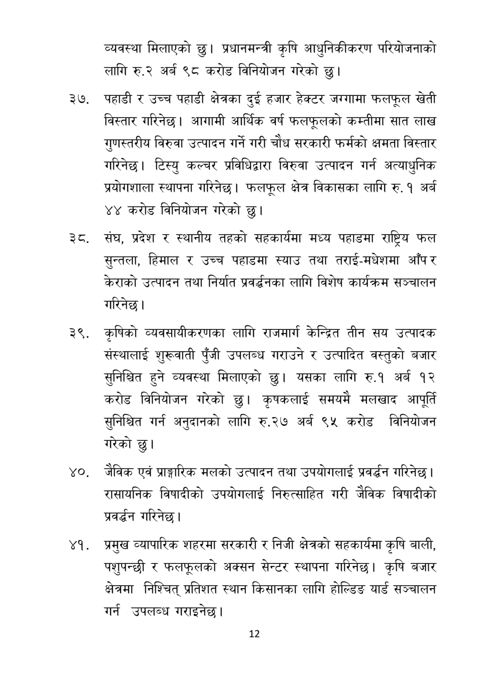

# Page 13 QA

## Rendered page


## Extracted text

```text
व्यवस्था मिलाएको छु। प्रधानमन्त्री कृषि आधुनिकीकरण परियोजनाको लागि रु.२ अर्ब ९८ करोड विनियोजन गरेको छु।
पहाडी र उच्च पहाडी क्षेत्रका दुई हजार हेक्टर जग्गामा फलफूल खेती विस्तार गरिनेछ। आगामी आर्थिक वर्ष फलफूलको कम्तीमा सात लाख गुणस्तरीय विरुवा उत्पादन गर्ने गरी चौध सरकारी फर्मको क्षमता विस्तार गरिनेछ। टिस्यु कल्चर प्रविधिद्वारा विरुवा उत्पादन गर्न अत्याधुनिक प्रयोगशाला स्थापना गरिनेछ। फलफूल क्षेत्र विकासका लागि रु. १ अर्ब ४४ करोड विनियोजन गरेको छु।
संघ, प्रदेश र स्थानीय तहको सहकार्यमा मध्य पहाडमा राष्ट्रिय फल सुन्तला, हिमाल र उच्च पहाडमा स्याउ तथा तराई-मधेशमा आँप र केराको उत्पादन तथा निर्यात प्रवर्द्धनका लागि विशेष कार्यक्रम सञ्चालन गरिनेछ।
कृषिको व्यवसायीकरणका लागि राजमार्ग केन्द्रित तीन सय उत्पादक संस्थालाई शुरूवाती पुँजी उपलब्ध गराउने र उत्पादित वस्तुको बजार सुनिश्चित हुने व्यवस्था मिलाएको छु। यसका लागि रु.१ अर्ब १२ करोड विनियोजन गरेको छु। कृषकलाई समयमै मलखाद आपूर्ति सुनिश्चित गर्न अनुदानको लागि रु.२७ अर्ब ९५ करोड विनियोजन गरेको छु।
जेविक एवं प्राङ्गारिक मलको उत्पादन तथा उपयोगलाई प्रवर्धन गरिनेछ | रासायनिक विषादीको उपयोगलाई निरुत्साहित गरी जैविक विषादीको प्रवर्धन गरिनेछ |
प्रमुख व्यापारिक शहरमा सरकारी र निजी क्षेत्रको सहकार्यमा कृषि बाली, पशुपन्छी र फलफूलको अक्सन सेन्टर स्थापना गरिनेछ। कृषि बजार क्षेत्रमा निश्चित प्रतिशत स्थान किसानका लागि होल्डिङ यार्ड सञ्चालन गर्न उपलब्ध गराइनेछ |
१२
```

## Flags
- None
