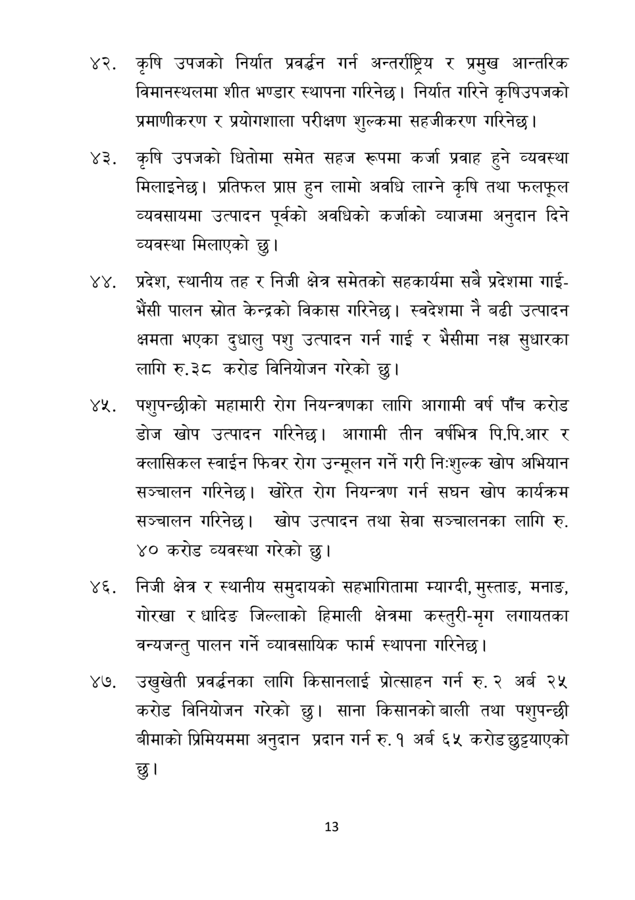

# Page 14 QA

## Rendered page


## Extracted text

```text
कृषि उपजको निर्यात प्रवर्धन गर्न अन्तर्राष्ट्रिय र प्रमुख आन्तरिक विमानस्थलमा शीत भण्डार स्थापना गरिनेछ। निर्यात गरिने कृषिउपजको प्रमाणीकरण र प्रयोगशाला परीक्षण शुल्कमा सहजीकरण गरिनेछ।
कृषि उपजको घितोमा समेत सहज रूपमा कर्जा प्रवाह हुने व्यवस्था मिलाइनेछ। प्रतिफल प्राप्त हुन लामो अवधि लाग्ने कृषि तथा फलफूल व्यवसायमा उत्पादन पूर्वको अवधिको कर्जाको व्याजमा अनुदान दिने व्यवस्था मिलाएको छु।
प्रदेश, स्थानीय तह र निजी क्षेत्र समेतको सहकार्यमा सबै प्रदेशमा गाईभैंसी पालन स्रोत केन्द्रको विकास गरिनेछ। स्वदेशमा नै बढी उत्पादन क्षमता भएका दुधालु पशु उत्पादन गर्न गाई र भैसीमा नक्ल सुधारका लागि रु.३८ करोड विनियोजन गरेको छु।
४ पशुपन्छीको महामारी रोग नियन्त्रणका लागि आगामी वर्ष पाँच करोड डोज खोप उत्पादन गरिनेछ। आगामी तीन वर्षभित्र पि.पि.आर र क्लासिकल स्वाईन फिवर रोग उन्मूलन गर्ने गरी निःशुल्क खोप अभियान सञ्चालन गरिनेछ। खोरेत रोग नियन्त्रण गर्न सघन खोप कार्यक्रम सञ्चालन गरिनेछ। खोप उत्पादन तथा सेवा सञ्चालनका लागि रु. ४० करोड व्यवस्था गरेको छु।
निजी क्षेत्र र स्थानीय समुदायको सहभागितामा म्याग्दी, मुस्ताङ, मनाङ, गोरखा र धादिङ जिल्लाको हिमाली क्षेत्रमा कस्तुरी-मृग लगायतका वन्यजन्तु पालन गर्ने व्यावसायिक फार्म स्थापना गरिनेछ।
उखुखेती प्रवर्धनका लागि किसानलाई प्रोत्साहन गर्न रु. २ अर्ब २५ करोड विनियोजन गरेको छु। साना किसानको बाली तथा पशुपन्छी बीमाको प्रिमियममा अनुदान प्रदान गर्न रु. १ अर्ब ६५ करोड छुट्ट्याएको छु।
१३
```

## Flags
- None
