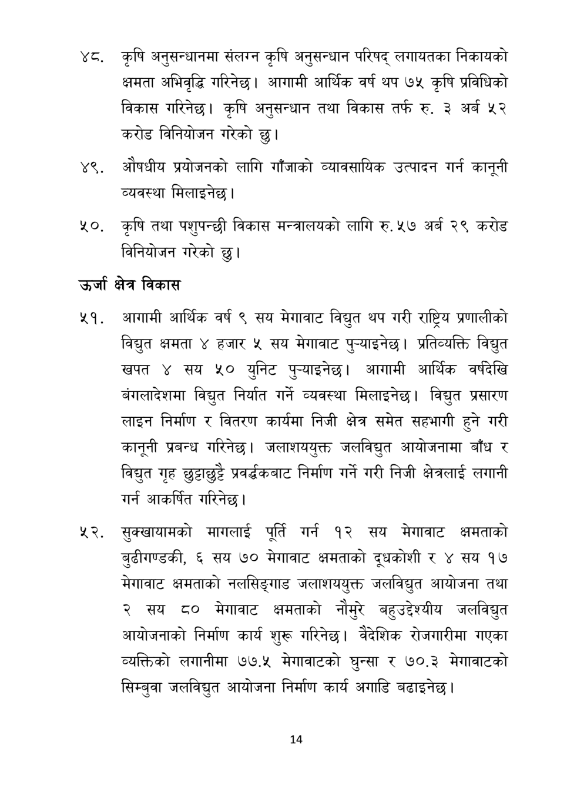

# Page 15 QA

## Rendered page


## Extracted text

```text
कृषि अनुसन्धानमा संलग्न कृषि अनुसन्धान परिषद्‌ लगायतका निकायको क्षमता अभिवृद्धि गरिनेछ। आगामी आर्थिक वर्ष थप ७५ कृषि प्रविधिको विकास गरिनेछ। कृषि अनुसन्धान तथा विकास तर्फ रु. ३ अर्ब ५२ करोड विनियोजन गरेको छु।
४९, औषधीय प्रयोजनको लागि गाँजाको व्यावसायिक उत्पादन गर्न कानूनी व्यवस्था मिलाइनेछ |
कृषि तथा पशुपन्छी विकास मन्त्रालयको लागि रु. ५७ अर्ब २९ करोड विनियोजन गरेको
उर्जा क्षेत्र विकास
सप. आगामी आर्थिक वर्ष ९ सय मेगावाट विद्युत थप गरी राष्ट्रिय प्रणालीको विद्युत क्षमता हजार ५ सय मेगावाट पुन्याइनेछ। प्रतिव्यक्ति विद्युत खपत ४ सय ५० युनिट पुन्याइनेछ। आगामी आर्थिक वर्षदेखि बंगलादेशमा विद्युत निर्यात गर्ने व्यवस्था मिलाइनेछ। विद्युत प्रसारण लाइन निर्माण र वितरण कार्यमा निजी क्षेत्र समेत सहभागी हुने गरी कानूनी प्रबन्ध गरिनेछ। जलाशययुक्त जलविद्युत आयोजनामा बाँध र विद्युत गृह छुट्टाछुट्टै प्रवर््धकबाट निर्माण गर्ने गरी निजी क्षेत्रलाई लगानी गर्न आकर्षित गरिनेछ।
सुक्खायामको मागलाई पूर्ति गर्न १२ सय मेगावाट क्षमताको बुढीगण्डकी, ६ सय ७० मेगावाट क्षमताको दूधकोशी र ४ सय १७ मेगावाट क्षमताको नलसिङ्गाड जलाशययुक्त जलविद्युत आयोजना तथा २ सय ८० मेगावाट क्षमताको नौमुरै बहुउद्देश्यीय जलविद्युत आयोजनाको निर्माण कार्य शुरू गरिनेछ। वैदेशिक रोजगारीमा गएका व्यक्तिको लगानीमा . मेगावाटको घुन्सा र ८०,३ मेगावाटको सिम्बुवा जलविद्युत आयोजना निर्माण कार्य अगाडि बढाइनेछ |
छु।
१४
```

## Flags
- None
