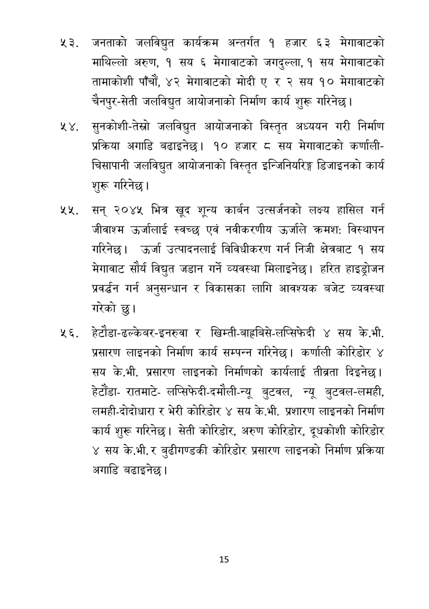

# Page 16 QA

## Rendered page


## Extracted text

```text
नरे. जनताको जलविद्युत कार्यक्रम अन्तर्गत १ हजार ६३ मेगावाटको माथिल्लो अरुण, १ सय ६ मेगावाटको जगदुल्ला, १ सय मेगावाटको तामाकोशी पाँचौं, ४२ मेगावाटको मोदी ए र २ सय १० मेगावाटको चैनपुर-सेती जलविद्युत आयोजनाको निर्माण कार्य शुरू गरिनेछ |
. सुनकोशी-तेस्रो जलविद्युत आयोजनाको विस्तृत अध्ययन गरी निर्माण प्रक्रिया अगाडि बढाइनेछ। १० हजार सय मेगावाटको कर्णालीचिसापानी जलविद्युत आयोजनाको विस्तृत इन्जिनियरिङ्ग डिजाइनको कार्य शुरू गरिनेछ।
४४ सन्‌ २०४५ भित्र खूद शून्य कार्बन उत्सर्जनको लक्ष्य हासिल गर्न जीवाश्म उर्जालाई स्वच्छ एवं नवीकरणीय उर्जाले क्रमश: विस्थापन गरिनेछ। उर्जा उत्पादनलाई विविधीकरण गर्न निजी क्षेत्रबाट १ सय मेगावाट सौर्य विद्युत जडान गर्ने व्यवस्था मिलाइनेछ। हरित हाइड्रोजन प्रवर्धन गर्न अनुसन्धान र विकासका लागि आवश्यक बजेट व्यवस्था गरेको छु।
हेटोडा-ढल्केबर-इनरुवा र खिम्ती-बाहबिसे-लप्सिफदी ४ सय के.भी. प्रसारण लाइनको निर्माण कार्य सम्पन्न गरिनेछ। कर्णाली कोरिडोर ४ सय के.भी. प्रसारण लाइनको निर्माणको कार्यलाई तीव्रता दिइनेछ | हेटौंडारातमाटेलप्सिफेदी-दमौली-न्यू बुटवल, न्यू बुटवल-लमही, लमही-दोदोधारा र भेरी कोरिडोर ४ सय के.भी. प्रशारण लाइनको निर्माण कार्य शुरू गरिनेछ। सेती कोरिडोर, अरुण कोरिडोर, दूधकोशी कोरिडोर ४ सय के.भी. र बुढीगण्डकी कोरिडोर प्रसारण लाइनको निर्माण प्रक्रिया अगाडि बढाइनेछ।
१५
```

## Flags
- None
