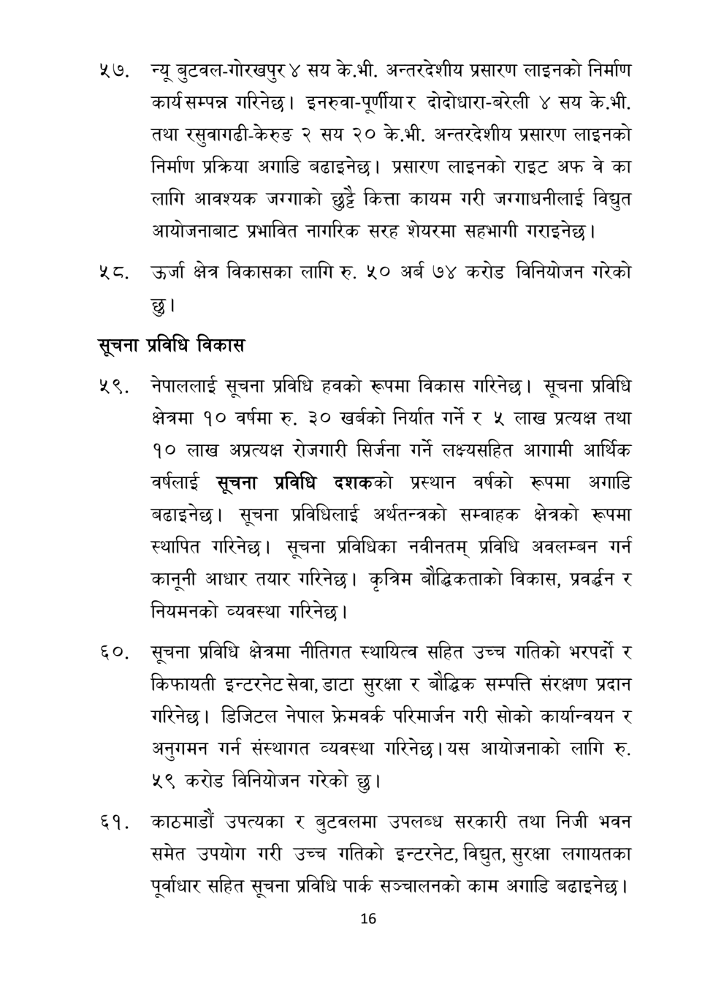

# Page 17 QA

## Rendered page


## Extracted text

```text
न्यू बुटवल-गोरखपुर ४ सय के.भी. अन्तरदेशीय प्रसारण लाइनको निर्माण कार्य सम्पन्न गरिनेछ। इनरुवा-पूर्णीयार दोदोधारा-बरेली ४ सय के.भी. तथा रसुवागढी-केरुङ २ सय २० के.भी. अन्तरदेशीय प्रसारण लाइनको निर्माण प्रक्रिया अगाडि बढाइनेछ। प्रसारण लाइनको राइट अफ वे का लागि आवश्यक जग्गाको छुट्टै कित्ता कायम गरी जग्गाधनीलाई विद्युत आयोजनाबाट प्रभावित नागरिक सरह शेयरमा सहभागी गराइनेछ |
नट. उर्जा क्षेत्र विकासका लागि रु. ५० अर्ब ७४ करोड विनियोजन गरेको छु।
सूचना प्रविधि विकास
नेपाललाई सूचना प्रविधि हवको रूपमा विकास गरिनेछ। सूचना प्रविधि क्षेत्रमा १० वर्षमा रु. ३० खर्बको निर्यात गर्ने र ५ लाख प्रत्यक्ष तथा १० लाख अप्रत्यक्ष रोजगारी सिर्जना गर्ने लक्ष्यसहित आगामी आर्थिक वर्षलाई सूचना प्रविधि दशकको प्रस्थान वर्षको रूपमा अगाडि बढाइनेछ। सूचना प्रविधिलाई अर्थतन्त्रको सम्वाहक क्षेत्रको रूपमा स्थापित गरिनेछ। सूचना प्रविधिका नवीनतम्‌ प्रविधि अवलम्बन गर्न कानूनी आधार तयार | कृत्रिम बौद्धिकताको विकास, प्रवर्धन र नियमनको व्यवस्था गरिनेछ।
६०, सूचना प्रविधि क्षेत्रमा नीतिगत स्थायित्व सहित उच्च गतिको भरपर्दो र किफायती इन्टरनेट सेवा, डाटा सुरक्षा र बौद्धिक सम्पत्ति संरक्षण प्रदान गरिनेछ। डिजिटल नेपाल फ्रेमवर्क परिमार्जन गरी सोको कार्यान्वयन र अनुगमन गर्न संस्थागत व्यवस्था गरिनेछ। यस आयोजनाको लागि रु. ५९ करोड विनियोजन गरेको छु।
काठमाडौं उपत्यका र बुटवलमा उपलब्ध सरकारी तथा निजी भवन समेत उपयोग गरी उच्च गतिको इन्टरनेट, विद्युत, सुरक्षा लगायतका पूर्वाधार सहित सूचना प्रविधि पार्क सञ्चालनको काम अगाडि बढाइनेछ।
१६
```

## Flags
- None
