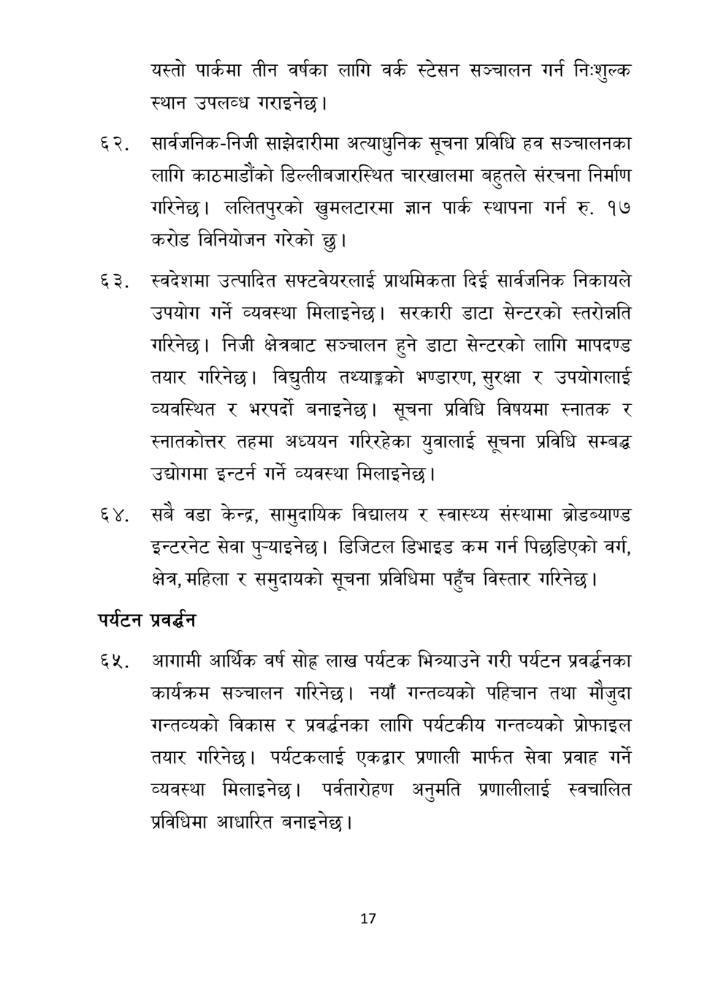

# Page 18 QA

## Rendered page


## Extracted text

```text
यस्तो पार्कमा तीन वर्षका लागि वर्क स्टेसन सञ्चालन गर्न निःशुल्क स्थान उपलव्ध गराइनेछ |
सार्वजनिक-निजी साझेदारीमा अत्याधुनिक सूचना प्रविधि हव सञ्चालनका लागि काठमाडौंको डिल्लीबजारस्थित चारखालमा बहुतले संरचना निर्माण गरिनेछ। ललितपुरको खुमलटारमा ज्ञान पार्क स्थापना गर्न रु. १७ करोड विनियोजन गरेको छु।
स्वदेशमा उत्पादित सफ्टवेयरलाई प्राथमिकता दिई सार्वजनिक निकायले उपयोग गर्ने व्यवस्था मिलाइनेछ। सरकारी डाटा सेन्टरको स्तरोन्नति गरिनेछ। निजी क्षेत्रबाट सञ्चालन हुने डाटा सेन्टरको लागि मापदण्ड तयार गरिनेछ। विद्युतीय तथ्याङ्कको भण्डारण, सुरक्षा र उपयोगलाई व्यवस्थित र भरपर्दो बनाइनेछ। सूचना प्रविधि विषयमा स्नातक र स्नातकोत्तर तहमा अध्ययन गरिरहेका युवालाई सूचना प्रविधि सम्बद्ध उद्योगमा इन्टर्न गर्ने व्यवस्था मिलाइनेछ |
सबै वडा केन्द्र, सामुदायिक विद्यालय र स्वास्थ्य संस्थामा ब्रोडब्याण्ड इन्टरनेट सेवा पुन्याइनेछ। डिजिटल डिभाइड कम गर्न पिछडिएको वर्ग, क्षेत्र, महिला र समुदायको सूचना प्रविधिमा पहुँच विस्तार गरिनेछ।
पर्यटन प्रवर्धन
आगामी आर्थिक वर्ष सोह लाख पर्यटक भित्र्याउने गरी पर्यटन प्रवर्धनका कार्यक्रम सञ्चालन गरिनेछ। नयाँ गन्तव्यको पहिचान तथा मौजुदा गन्तव्यको विकास र प्रवर्द्धनका लागि पर्यटकीय गन्तव्यको प्रोफाइल तयार गरिनेछ। पर्यटकलाई एकद्वार प्रणाली मार्फत सेवा प्रवाह गर्ने व्यवस्था मिलाइनेछ। पर्वतारोहण अनुमति प्रणालीलाई स्वचालित प्रविधिमा आधारित बनाइनेछ |
१७
```

## Flags
- None
