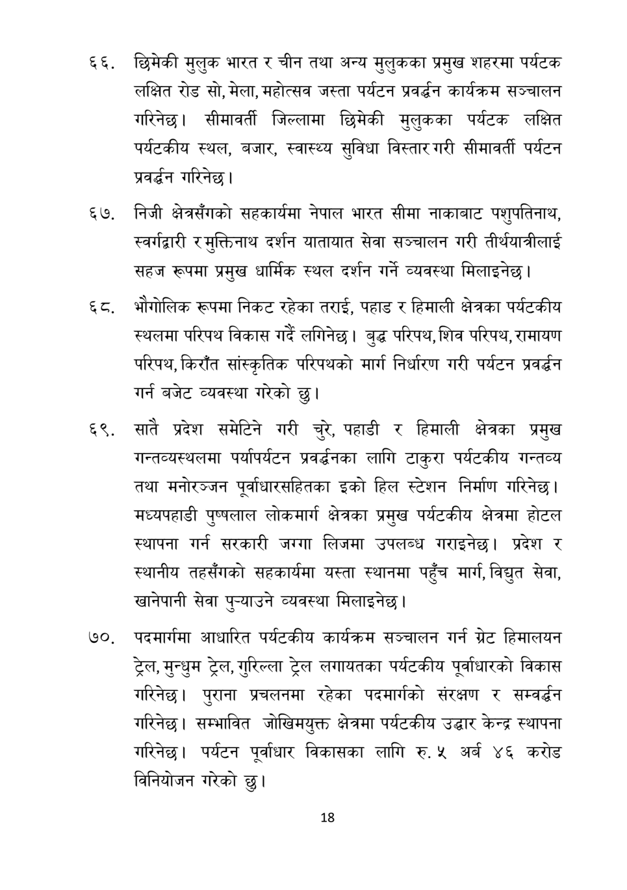

# Page 19 QA

## Rendered page


## Extracted text

```text
छिमेकी मुलुक भारत र चीन तथा अन्य मुलुकका प्रमुख शहरमा पर्यटक लक्षित रोड सो, मेला, महोत्सव जस्ता पर्यटन प्रवर्धन कार्यक्रम सञ्चालन गरिनेछ। सीमावर्ती जिल्लामा छिमेकी मुलुकका पर्यटक लक्षित पर्यटकीय स्थल, बजार, स्वास्थ्य सुविधा विस्तार गरी सीमावर्ती पर्यटन प्रवर्धन गरिनेछ।
६५७, निजी क्षेत्रसँगको सहकार्यमा नेपाल भारत सीमा नाकाबाट पशुपतिनाथ, स्वर्गद्वारी र मुक्तिनाथ दर्शन यातायात सेवा सञ्चालन गरी तीर्थयात्रीलाई सहज रूपमा प्रमुख धार्मिक स्थल दर्शन गर्ने व्यवस्था मिलाइनेछ।
घट, भौगोलिक रूपमा निकट रहेका तराई, पहाड र हिमाली क्षेत्रका पर्यटकीय स्थलमा परिपथ विकास गर्दै लगिनेछ | बुद्ध परिपथ, शिव परिपथ, रामायण परिपथ, किराँत सांस्कृतिक परिपथको मार्ग निर्धारण गरी पर्यटन प्रवर्धन गर्न बजेट व्यवस्था गरेको छु।
सातै प्रदेश समेटिने गरी चुरे, पहाडी र हिमाली क्षेत्रका प्रमुख गन्तव्यस्थलमा पर्यापर्यटन प्रवर्धनका लागि टाकुरा पर्यटकीय गन्तव्य तथा मनोरञ्जन पूर्वाधारसहितका इको हिल स्टेशन निर्माण गरिनेछ | मध्यपहाडी पुष्पलाल लोकमार्ग क्षेत्रका प्रमुख पर्यटकीय क्षेत्रमा होटल स्थापना गर्न सरकारी जग्गा लिजमा उपलब्ध गराइनेछ। प्रदेश र स्थानीय तहसँगको सहकार्यमा यस्ता स्थानमा पहुँच मार्ग, विद्युत सेवा, खानेपानी सेवा पुन्याउने व्यवस्था मिलाइनेछ।
७०, पदमार्गमा आधारित पर्यटकीय कार्यक्रम सञ्चालन गर्न ग्रेट हिमालयन ट्रेल, मुन्धुम ट्रेल, गुरिल्ला ट्रेल लगायतका पर्यटकीय पूर्वाधारको विकास गरिनेछ। पुराना प्रचलनमा रहेका पदमार्गको संरक्षण र सम्वर्द्धन गरिनेछ। सम्भावित जोखिमयुक्त क्षेत्रमा पर्यटकीय उद्धार केन्द्र स्थापना गरिनेछ। पर्यटन पूर्वाधार विकासका लागि रु. ५ अर्ब ४६ करोड विनियोजन गरेको छु।
१८
```

## Flags
- None
