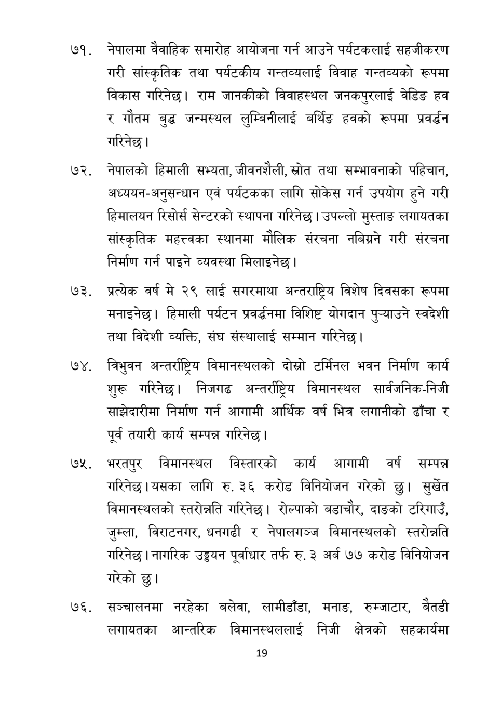

# Page 20 QA

## Rendered page


## Extracted text

```text
नेपालमा वैवाहिक समारोह आयोजना गर्न आउने पर्यटकलाई सहजीकरण गरी सांस्कृतिक तथा पर्यटकीय गन्तव्यलाई विवाह गन्तव्यको रूपमा विकास गरिनेछ। राम जानकीको विवाहस्थल जनकपुरलाई वेडिङ हव र गौतम बुद्ध जन्मस्थल लुम्बिनीलाई बर्थिङ हवको रूपमा प्रवर्द्धन गरिनेछ |
नेपालको हिमाली सभ्यता, जीवनशैली, स्रोत तथा सम्भावनाको पहिचान, अध्ययन-अनुसन्धान एवं पर्यटकका लागि सोकेस गर्न उपयोग हुने गरी हिमालयन रिसोर्स सेन्टरको स्थापना गरिनेछ। उपल्लो मुस्ताङ लगायतका सांस्कृतिक महत्त्वका स्थानमा मौलिक संरचना नबिग्रने गरी संरचना निर्माण गर्न पाइने व्यवस्था मिलाइनेछ।
प्रत्येक वर्ष मे २९ लाई सगरमाथा अन्तराष्ट्रिय विशेष दिवसका रूपमा मनाइनेछ। हिमाली पर्यटन प्रवर्द्धनमा विशिष्ट योगदान पुन्याउने स्वदेशी तथा विदेशी व्यक्ति, संघ संस्थालाई सम्मान गरिनेछ |
७४, त्रिभुवन अन्तर्राष्ट्रिय विमानस्थलको दोस्रो टर्मिनल भवन निर्माण कार्य शुरू गरिनेछ। निजगढ अन्तर्राष्ट्रिय विमानस्थल सार्वजनिक-निजी साझेदारीमा निर्माण गर्न आगामी आर्थिक वर्ष भित्र लगानीको ढाँचा र पूर्व तयारी कार्य सम्पन्न गरिनेछ।
भरतपुर विमानस्थल विस्तारको कार्य आगामी वर्ष सम्पन्न गरिनेछ। यसका लागि रु. ३६ करोड विनियोजन गरेको छु। सुर्खेत विमानस्थलको स्तरोन्नति गरिनेछ। रोल्पाको वडाचौर, दाङको टरिगाउँ, जुम्ला, विराटनगर, धनगढी र नेपालगञ्ज विमानस्थलको स्तरोन्नति गरिनेछ। नागरिक उड्डयन पूर्वाधार तर्फ रु. ३ अर्ब ७७ करोड विनियोजन गरेको छु।
सञ्चालनमा नरहेका बलेवा, लामीडाँडा, मनाङ, रुम्जाटार, बैतडी लगायतका आन्तरिक विमानस्थललाई निजी क्षेत्रको सहकार्यमा
१९
```

## Flags
- None
