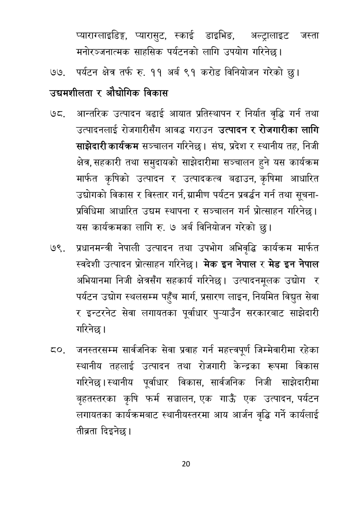

# Page 21 QA

## Rendered page


## Extracted text

```text
प्याराग्लाइडिङ्ग, प्यारासुट, स्काई डाइभिङ, अल्ट्रालाइट जस्ता मनोरञ्जनात्मक साहसिक पर्यटनको लागि उपयोग गरिनेछ |
पर्यटन क्षेत्र तर्फ रु. ११ अर्ब ९१ करोड विनियोजन गरेको छु।
उद्यमशीलता र औद्योगिक विकास
आन्तरिक उत्पादन बढाई आयात प्रतिस्थापन र निर्यात वृद्धि गर्न तथा उत्पादनलाई रोजगारीसँग आवद्ध गराउन उत्पादन र रोजगारीका लागि साझेदारी कार्यक्रम सञ्चालन गरिनेछ। संघ, प्रदेश र स्थानीय तह, निजी क्षेत्र, सहकारी तथा समुदायको साझेदारीमा सञ्चालन हुने यस कार्यक्रम मार्फत कृषिको उत्पादन र उत्पादकत्व बढाउन, कृषिमा आधारित उद्योगको विकास र विस्तार गर्न, ग्रामीण पर्यटन प्रवर्द्धन गर्न तथा सूचनाप्रविधिमा आधारित उद्यम स्थापना र सञ्चालन गर्न प्रोत्साहन गरिनेछ | यस कार्यक्रमका लागि रु. ७ अर्ब विनियोजन गरेको छु।
प्रधानमन्त्री नेपाली उत्पादन तथा उपभोग अभिवृद्धि कार्यक्रम मार्फत स्वदेशी उत्पादन प्रोत्साहन गरिनेछ। मेक इन नेपाल र मेड इन नेपाल अभियानमा निजी क्षेत्रसँग सहकार्य गरिनेछ। उत्पादनमूलक उद्योग र पर्यटन उद्योग स्थलसम्म पहुँच मार्ग, प्रसारण लाइन, नियमित विद्युत सेवा र इन्टरनेट सेवा लगायतका पूर्वाधार पुन्याउँन सरकारबाट साझेदारी गरिनेछ।
८६७, जनस्तरसम्म सार्वजनिक सेवा प्रवाह गर्न महत्त्वपूर्ण जिम्मेवारीमा रहेका स्थानीय तहलाई उत्पादन तथा रोजगारी केन्द्रका रूपमा विकास गरिनेछ। स्थानीय पूर्वाधार विकास, सार्वजनिक निजी साझेदारीमा बृहतस्तरका कृषि फर्म सञ्चालन, एक गाउँ एक उत्पादन, पर्यटन लगायतका कार्यक्रमबाट स्थानीयस्तरमा आय आर्जन वृद्धि गर्ने कार्यलाई तीब्रता दिइनेछ।
२०
```

## Flags
- None
