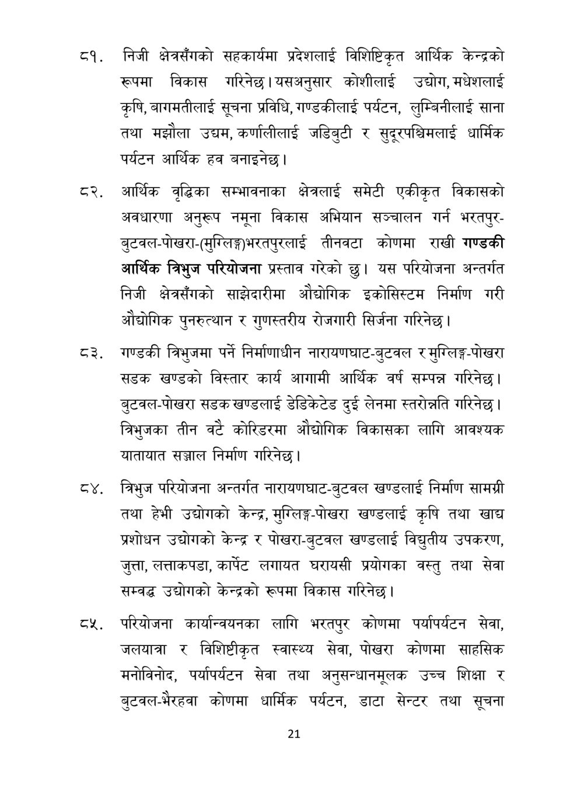

# Page 22 QA

## Rendered page


## Extracted text

```text
निजी क्षेत्रसँगको सहकार्यमा प्रदेशलाई विशिष्टिकृत आर्थिक केन्द्रको रूपमा विकास गरिनेछ। यसअनुसार कोशीलाई उद्योग, मधेशलाई कृषि, बागमतीलाई सूचना प्रविधि, गण्डकीलाई पर्यटन, लुम्बिनीलाई साना तथा मझौला उद्यम, कर्णालीलाई जडिबुटी र सुदूरपश्चिमलाई धार्मिक पर्यटन आर्थिक हव बनाइनेछ।
आर्थिक वृद्धिका सम्भावनाका क्षेत्रलाई समेटी एकीकृत विकासको अवधारणा अनुरूप नमूना विकास अभियान सञ्चालन गर्न भरतपुरबुटवल-पोखरा-(मुग्लिङ्गभरतपुरलाई तीनवटा कोणमा राखी गण्डकी आर्थिक च्रिभुज परियोजना प्रस्ताव गरेको छु। यस परियोजना अन्तर्गत निजी क्षेत्रसँगको साझेदारीमा औद्योगिक इकोसिस्टम निर्माण गरी औद्योगिक पुनरुत्थान र गुणस्तरीय रोजगारी सिर्जना गरिनेछ |
ट३. गण्डकी त्रिभुजमा पर्ने निर्माणाधीन नारायणघाट-बुटवल र मुगिलिङ्ग-पोखरा सडक खण्डको विस्तार कार्य आगामी आर्थिक वर्ष सम्पन्न गरिनेछ। बुटवल-पोखरा सडक खण्डलाई डेडिकेटेड दुई लेनमा स्तरोन्नति गरिनेछ | व्रिभुजका तीन वटै कोरिडरमा औद्योगिक विकासका लागि आवश्यक यातायात सञ्जाल निर्माण गरिनेछ।
परियोजना अन्तर्गत नारायणघाट-बुटवल खण्डलाई निर्माण सामग्री तथा हेभी उद्योगको केन्द्र, मुग्लिङ्गपोखरा खण्डलाई कृषि तथा खाद्य प्रशोधन उद्योगको केन्द्र र पोखरा-बुटवल खण्डलाई विद्युतीय उपकरण, जुत्ता, लत्ताकपडा, कार्पेट लगायत घरायसी प्रयोगका वस्तु तथा सेवा सम्वद्ध उद्योगको केन्द्रको रूपमा विकास गरिनेछ |
परियोजना कार्यान्वयनका लागि भरतपुर कोणमा पर्यापर्यटन सेवा, जलयात्रा र विशिष्टीकृत स्वास्थ्य सेवा, पोखरा कोणमा साहसिक मनोविनोद, पर्यापर्यटन सेवा तथा अनुसन्धानमूलक उच्च शिक्षा र बुटवल-भैरहवा कोणमा धार्मिक पर्यटन, डाटा सेन्टर तथा सूचना
२१
```

## Flags
- None
