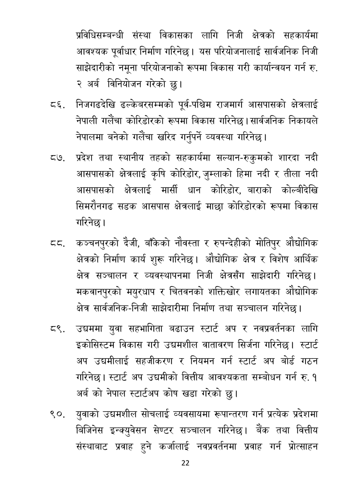

# Page 23 QA

## Rendered page


## Extracted text

```text
प्रविधिसम्बन्धी संस्था विकासका लागि निजी क्षेत्रको सहकार्यमा आवश्यक पूर्वाधार निर्माण गरिनेछ। यस परियोजनालाई सार्वजनिक निजी साझेदारीको नमूना परियोजनाको रूपमा विकास गरी कार्यान्वयन गर्न रु. २ अर्ब विनियोजन गरेको छु।
व्६. निजगढदेखि ढल्केबरसम्मको पूर्व-पश्चिम राजमार्ग आसपासको क्षेत्रलाई नेपाली गलैचा कोरिडोरको रूपमा विकास गरिनेछ | सार्वजनिक निकायले नेपालमा बनेको गलैँचा खरिद गर्नुपर्ने व्यवस्था गरिनेछ |
प्रदेश तथा स्थानीय तहको सहकार्यमा सल्यान-रुकुमको शारदा नदी आसपासको क्षेत्रलाई कृषि कोरिडोर, जुम्लाको हिमा नदी र तीला नदी आसपासको क्षेत्रलाई मार्सी धान कोरिडोर, बाराको कोल्बीदेखि सिमरौनगढ सडक आसपास क्षेत्रलाई माछा कोरिडोरको रूपमा विकास गरिनेछ।
कञ्चनपुरको दैजी, बाँकेको नौवस्ता र रुपन्देहीको मोतिपुर औद्योगिक क्षेत्रको निर्माण कार्य शुरू गरिनेछ। औद्योगिक क्षेत्र र विशेष आर्थिक क्षेत्र सञ्चालन र व्यवस्थापनमा निजी क्षेत्रसँग साझेदारी गरिनेछ। मकवानपुरको मयुरधाप र चितवनको शक्तिखोर लगायतका औद्योगिक क्षेत्र सार्वजनिक-निजी साझेदारीमा निर्माण तथा सञ्चालन गरिनेछ |
९, उद्चममा युवा सहभागिता बढाउन स्टार्ट अप र नवप्रवर्ततका लागि इकोसिस्टम विकास गरी उद्यमशील वातावरण सिर्जना गरिनेछ। स्टार्ट अप उद्यमीलाई सहजीकरण र नियमन गर्न स्टार्ट अप बोर्ड गठन ररिनेछ। स्टार्ट अप उद्यमीको वित्तीय आवश्यकता सम्बोधन गर्न रु. १ अर्ब को नेपाल स्टार्टअप कोष खडा गरेको |
९०, युवाको उद्यमशील सोचलाई व्यवसायमा रूपान्तरण गर्न प्रत्येक प्रदेशमा बिजिनेस इन्क्युवेसन सेण्टर सञ्चालन गरिनेछ। बैंक तथा वित्तीय संस्थाबाट प्रवाह हुने कर्जालाई नवप्रवर्तनमा प्रवाह गर्न प्रोत्साहन
२२
```

## Flags
- None
