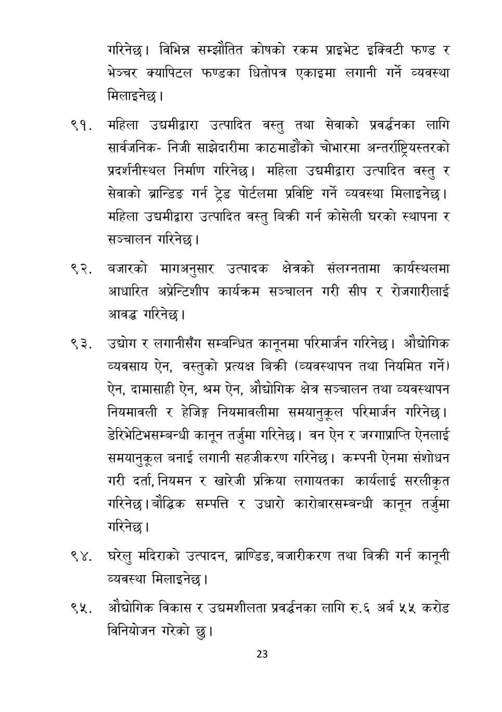

# Page 24 QA

## Rendered page


## Extracted text

```text
गरिनेछ। विभिन्न सम्झौतित कोषको रकम प्राइभेट इक्विटी फण्ड र भेञ्चर क्यापिटल फण्डका धितोपत्र एकाइमा लगानी गर्ने व्यवस्था मिलाइनेछ।
महिला उद्यमीद्वारा उत्पादित वस्तु तथा सेवाको प्रवर्धनका लागि सार्वजनिकनिजी साझेदारीमा काठमाडौंको चोभारमा अन्तर्राष्ट्रियस्तरको प्रदर्शनीस्थल निर्माण गरिनेछ। महिला उद्यमीद्वारा उत्पादित वस्तु र सेवाको ब्रान्डिङ गर्न ट्रेड पोर्टलमा प्रविष्टि गर्ने व्यवस्था मिलाइनेछ | महिला उद्यमीद्वारा उत्पादित वस्तु बिक्री गर्न कोसेली घरको स्थापना र सञ्चालन गरिनेछ।
बजारको मागअनुसार उत्पादक क्षेत्रको संलग्नतामा कार्यस्थलमा आधारित अप्रेन्टिशीप कार्यक्रम सञ्चालन गरी सीप र रोजगारीलाई आवद्ध गरिनेछ।
उद्योग र लगानीसँग सम्बन्धित कानूनमा परिमार्जन गरिनेछ। औद्योगिक व्यवसाय ऐन, वस्तुको प्रत्यक्ष बिक्री (व्यवस्थापन तथा नियमित गर्ने) ऐन, दामासाही ऐन, श्रम ऐन, औद्योगिक क्षेत्र सञ्चालन तथा व्यवस्थापन नियमावली र हेजिङ्ग नियमावलीमा समयानुकूल परिमार्जन गरिनेछ | डेरिभेटिभसम्बन्धी कानून तर्जुमा गरिनेछ। वन ऐन र जग्गाप्राप्ति ऐनलाई समयानुकूल बनाई लगानी सहजीकरण गरिनेछ। कम्पनी ऐनमा संशोधन गरी दर्ता, नियमन र खारेजी प्रक्रिया लगायतका कार्यलाई सरलीकृत गरिनेछ। बौद्धिक सम्पत्ति र उधारो कारोबारसम्बन्धी कानून तर्जुमा गरिनेछ।
९४, घरेलु मदिराको उत्पादन, ब्राण्डिङ, बजारीकरण तथा बिक्री गर्न कानूनी व्यवस्था मिलाइनेछ |
ओद्योगिक विकास र उद्यमशीलता प्रवर्धनका लागि रु.६ अर्ब ५५ करोड विनियोजन गरेको छु।
२३
```

## Flags
- None
