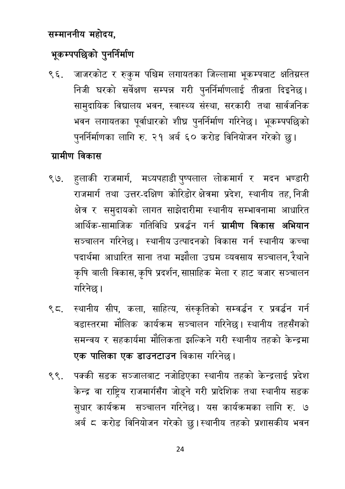

# Page 25 QA

## Rendered page


## Extracted text

```text
सम्माननीय
महोदय,
भूकम्पपछिको पुनर्निर्माण
जाजरकोट र रुकुम पश्चिम लगायतका जिल्लामा भूकम्पबाट क्षतिग्रस्त निजी घरको सर्वेक्षण सम्पन्न गरी पुनर्निर्माणलाई तीब्रता दिइनेछ। सामुदायिक विद्यालय भवन, स्वास्थ्य संस्था, सरकारी तथा सार्वजनिक भवन लगायतका पूर्वाधारको शीघ्र पुनर्निर्माण गरिनेछ। भूकम्पपछिको पुनर्निर्माणका लागि रु. २१ अर्ब ६० करोड विनियोजन गरेको छु।
ग्रामीण विकास
हुलाकी राजमार्ग, मध्यपहाडी पुष्पलाल लोकमार्ग र मदन भण्डारी राजमार्ग तथा उत्तर-दक्षिण कोरिडोर क्षेत्रमा प्रदेश, स्थानीय तह, निजी क्षेत्र र समुदायको लागत साझेदारीमा स्थानीय सम्भावनामा आधारित आर्थिक-सामाजिक गतिविधि प्रवर्धन गर्न ग्रामीण विकास अभियान सञ्चालन गरिनेछ। स्थानीय उत्पादनको विकास गर्न स्थानीय कच्चा पदार्थमा आधारित साना तथा मझौला उच्चम व्यवसाय सञ्चालन, रेथाने कृषि बाली विकास, कृषि प्रदर्शन, साप्ताहिक मेला र हाट बजार सञ्चालन गरिनेछ।
. स्थानीय सीप, कला, साहित्य, संस्कृतिको सम्वर््धन र प्रवर्धन गर्न वडास्तरमा मौलिक कार्यक्रम सञ्चालन गरिनेछ। स्थानीय तहसँगको समन्वय र सहकार्यमा मौलिकता झल्किने गरी स्थानीय तहको केन्द्रमा एक पालिका एक डाउनटाउन विकास गरिनेछ |
पक्की सडक सञ्जालबाट नजोडिएका स्थानीय तहको केन्द्रलाई प्रदेश केन्द्र वा राष्ट्रिय राजमार्गसँग जोड्ने गरी प्रादेशिक तथा स्थानीय सडक सुधार कार्यक्रम सञ्चालन गरिनेछ। यस कार्यक्रमका लागि रु. ७ अर्ब ८ करोड विनियोजन गरेको | स्थानीय तहको प्रशासकीय भवन
२४
```

## Flags
- None
