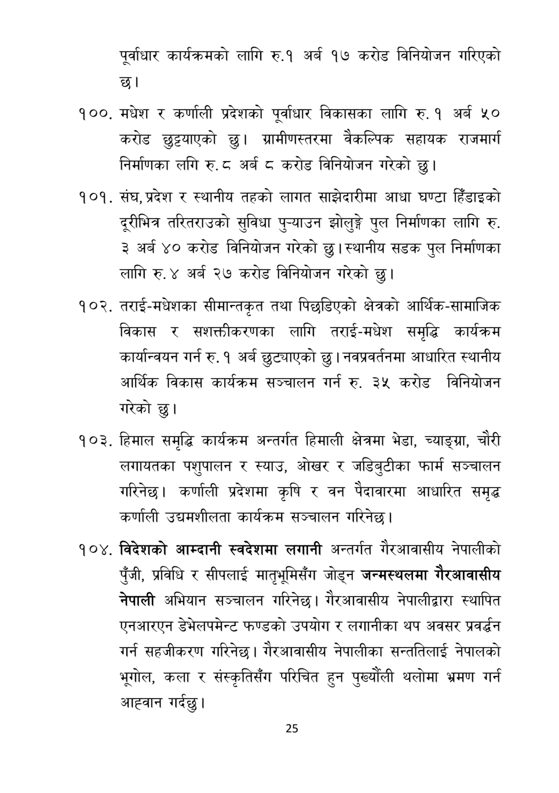

# Page 26 QA

## Rendered page


## Extracted text

```text
पूर्वाधार कार्यक्रमको लागि रु.१ अर्ब १७ करोड विनियोजन गरिएको छ।
१००, मधेश र कर्णाली प्रदेशको पूर्वाधार विकासका लागि रु. १ अर्ब ५० करोड छुट्टयाएको | ग्रामीणस्तरमा वैकल्पिक सहायक राजमार्ग निर्माणका लगि रु. ८ अर्ब ८ करोड विनियोजन गरेको छु।
संघ, प्रदेश र स्थानीय तहको लागत साझेदारीमा आधा घण्टा हिँडाइको दूरीभित्र तरितराउको सुविधा पुन्याउन झोलुङ्गे पुल निर्माणका लागि रु. ३ अर्ब ४० करोड विनियोजन गरेको छु। स्थानीय सडक पुल निर्माणका लागि रु. ४ अर्ब २७ करोड विनियोजन गरेको छु।
तराई-मधेशका सीमान्तकृत तथा पिछडिएको क्षेत्रको आर्थिक-सामाजिक विकास र सशक्तीकरणका लागि तराई-मधेश समृद्धि कार्यक्रम कार्यान्वयन गर्न रु. १ अर्ब छुट्याएको | नवप्रवर्तनमा आधारित स्थानीय आर्थिक विकास कार्यक्रम सञ्चालन गर्न रु. ३५ करोड विनियोजन गरेको छु।
हिमाल समृद्धि कार्यक्रम अन्तर्गत हिमाली क्षेत्रमा भेडा, च्याङ्ग्रा, चौरी लगायतका पशुपालन र स्याउ, ओखर र जडिबुटीका फार्म सञ्चालन गरिनेछ। कर्णाली प्रदेशमा कृषि र वन पैदावारमा आधारित समृद्ध कर्णाली उद्यमशीलता कार्यक्रम सञ्चालन गरिनेछ।
विदेशको आम्दानी स्वदेशमा लगानी अन्तर्गत गैरआवासीय नेपालीको पुँजी, प्रविधि र सीपलाई मातृभूमिसँग जोड्न जन्मस्थलमा गैरआवासीय नेपाली अभियान सञ्चालन गरिनेछ। गैरआवासीय नेपालीद्वारा स्थापित एनआरएन डेभेलपमेन्ट फण्डको उपयोग र लगानीका थप अवसर प्रवर्धन गर्न सहजीकरण गरिनेछ। गैरआवासीय नेपालीका सन्ततिलाई नेपालको भूगोल, कला र संस्कृतिसँग परिचित हुन पुख्यौली थलोमा भ्रमण गर्न आह्वान गर्दछु।
२५
```

## Flags
- None
