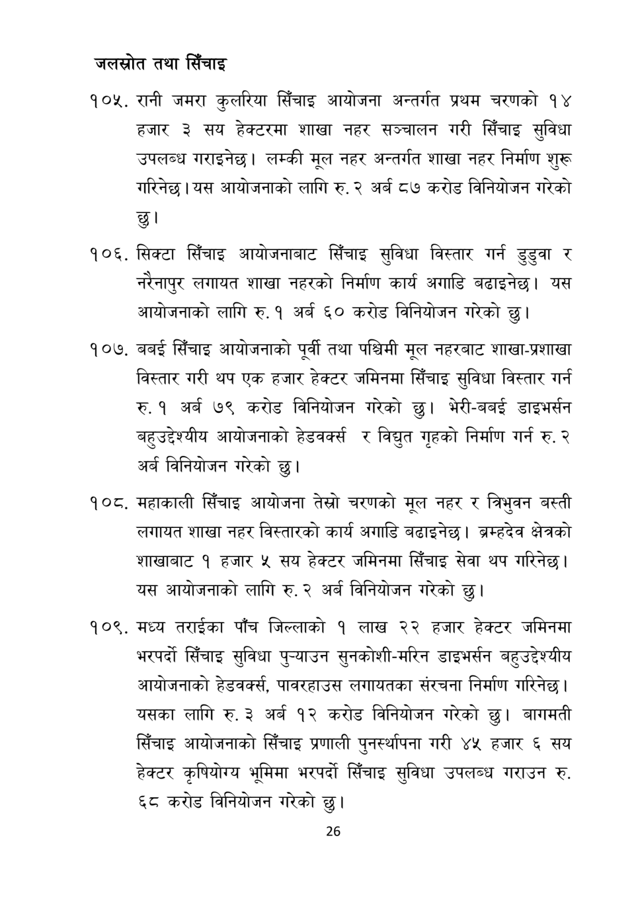

# Page 27 QA

## Rendered page


## Extracted text

```text
जलस्रोत तथा सिँचाइ
रानी जमरा कुलरिया सिँचाइ आयोजना अन्तर्गत प्रथम चरणको १४ हजार ३ सय हेक्टरमा शाखा नहर सञ्चालन गरी सिँचाइ सुविधा उपलब्ध गराइनेछ। लम्की मूल नहर अन्तर्गत शाखा नहर निर्माण शुरू गरिनेछ। यस आयोजनाको लागि रु. २ अर्ब ८७ करोड विनियोजन गरेको छु।
सिक्टा सिँचाइ आयोजनाबाट सिँचाइ सुविधा विस्तार गर्न डुडुवा र नरेनापुर लगायत शाखा नहरको निर्माण कार्य अगाडि बढाइनेछ। यस आयोजनाको लागि रु. १ अर्ब ६० करोड विनियोजन गरेको छु।
बबई सिँचाइ आयोजनाको पूर्वी तथा पश्चिमी मूल नहरबाट शाखा-प्रशाखा विस्तार गरी थप एक हजार हेक्टर जमिनमा सिँचाइ सुविधा विस्तार गर्न रु. १ अर्ब ७९ करोड विनियोजन गरेको छु। भेरी-बबई डाइभर्सन बहुउद्देश्यीय आयोजनाको हेडवर्क्स र विद्युत गृहको निर्माण गर्न रु. २ अर्ब विनियोजन गरेको छु।
महाकाली सिँचाइ आयोजना तेस्रो चरणको मूल नहर र त्रिभुवन बस्ती लगायत शाखा नहर विस्तारको कार्य अगाडि बढाइनेछ। ब्रम्हदेव क्षेत्रको शाखाबाट १ हजार ५ सय हेक्टर जमिनमा सिँचाइ सेवा थप गरिनेछ। यस आयोजनाको लागि रु. २ अर्ब विनियोजन गरेको
छु।
मध्य तराईका पाँच जिल्लाको १ लाख २२ हजार हेक्टर जमिनमा भरपर्दो सिँचाइ सुविधा पुन्याउन सुनकोशी-मरिन डाइभर्सन बहुउद्देश्यीय आयोजनाको हेडवर्क्स, पावरहाउस लगायतका संरचना निर्माण गरिनेछ। यसका लागि रु. ३ अर्ब १२ करोड विनियोजन गरेको छु। बागमती सिँचाइ आयोजनाको सिँचाइ प्रणाली पुनर्स्थापना गरी ४५ हजार ६ सय हेक्टर कृषियोग्य भूमिमा भरपर्दो सिँचाइ सुविधा उपलब्ध गराउन रु. ६८ करोड विनियोजन गरेको छु।
२६
```

## Flags
- None
