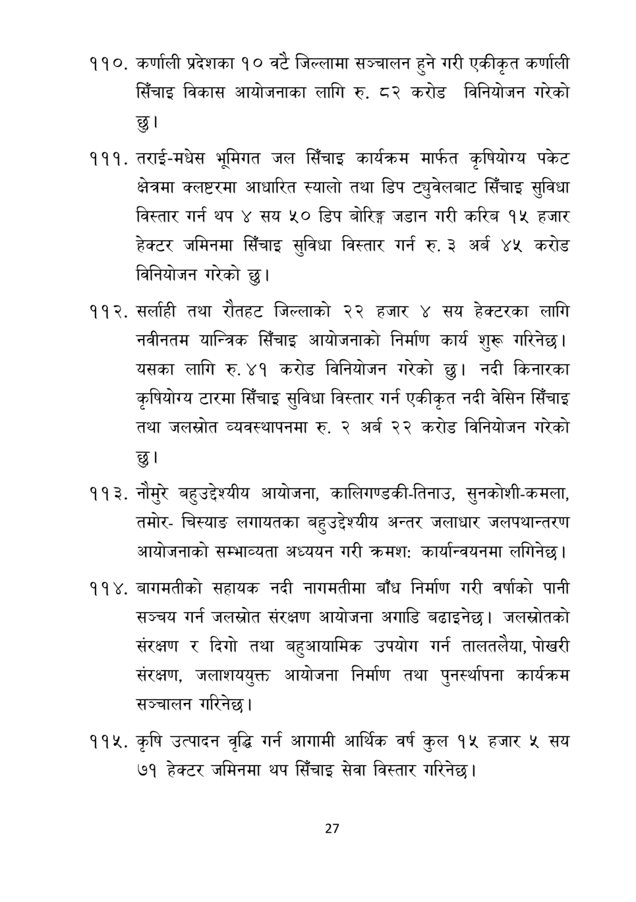

# Page 28 QA

## Rendered page


## Extracted text

```text
कर्णाली प्रदेशका १० वटै जिल्लामा सञ्चालन हुने गरी एकीकृत कर्णाली सिँचाइ विकास आयोजनाका लागि रु. ८२ करोड विनियोजन गरेको छु।
. तराई-मधेस भूमिगत जल सिँचाइ कार्यक्रम मार्फत कृषियोग्य पकेट क्षेत्रमा क्लष्टरमा आधारित स्यालो तथा डिप ट्युवेलबाट सिँचाइ सुविधा विस्तार गर्न थप ४ सय ५० डिप बोरिङ्ग जडान गरी करिब १५ हजार हेक्टर जमिनमा सिँचाइ सुविधा विस्तार गर्न रु. ३ अर्ब ४५ करोड विनियोजन गरेको छु।
सर्लाही तथा रौतहट जिल्लाको २२ हजार ४ सय हेक्टरका लागि नवीनतम यान्त्रिक सिँचाइ आयोजनाको निर्माण कार्य शुरू गरिनेछ। यसका लागि रु. ४१ करोड विनियोजन गरेको छु। नदी किनारका कृषियोग्य टारमा सिँचाइ सुविधा विस्तार गर्न एकीकृत नदी वेसिन सिँचाइ तथा जलस्रोत व्यवस्थापनमा रु. २ अर्ब २२ करोड विनियोजन गरेको छु।
नौमुरे बहुउद्देश्यीय आयोजना, कालिगण्डकी-तिनाउ, सुनकोशी-कमला, तमोरचिस्याङ लगायतका बहुउद्देश्यीय अन्तर जलाधार जलपथान्तरण आयोजनाको सम्भाव्यता अध्ययन गरी क्रमश: कार्यान्वयनमा लगिनेछ |
बागमतीको सहायक नदी नागमतीमा बाँध निर्माण गरी वर्षाको पानी सञ्चय गर्न जलस्रोत संरक्षण आयोजना अगाडि बढाइनेछ। जलस्रोतको संरक्षण र दिगो तथा बहुआयामिक उपयोग गर्न तालतलैया, पोखरी संरक्षण, जलाशययुक्त आयोजना निर्माण तथा पुनर्स्थापना कार्यक्रम सञ्चालन गरिनेछ।
कृषि उत्पादन वृद्धि गर्न आगामी आर्थिक वर्ष कुल १५ हजार ५ सय ७१ हेक्टर जमिनमा थप सिँचाइ सेवा विस्तार गरिनेछ।
२७
```

## Flags
- None
