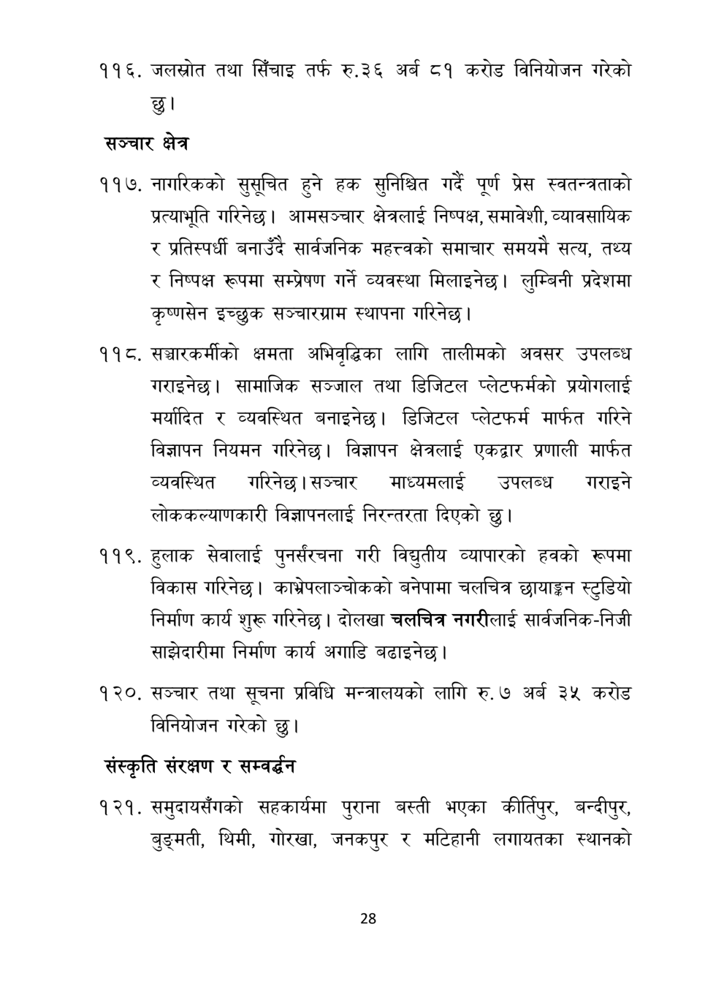

# Page 29 QA

## Rendered page


## Extracted text

```text
जलस्रोत तथा सिँचाइ तर्फ रु.३६ अर्ब ८१ करोड विनियोजन गरेको छु।
सञ्चार क्षेत्र
नागरिकको सुसूचित हुने हक सुनिश्चित गर्दै पूर्ण प्रेस स्वतन्त्रताको प्रत्याभूति गरिनेछ। आमसञ्चार क्षेत्रलाई निष्पक्ष, समावेशी, व्यावसायिक र प्रतिस्पर्धी बनाउँदै सार्वजनिक महत्त्वको समाचार समयमै सत्य, तथ्य र निष्पक्ष रूपमा सम्प्रेषण गर्ने व्यवस्था मिलाइनेछ। लुम्बिनी प्रदेशमा कृष्णसेन इच्छुक सञ्चारग्राम स्थापना गरिनेछ |
११ ८. सञ्चारकर्मीको क्षमता अभिवृद्धिका लागि तालीमको अवसर उपलब्ध गराइनेछ। सामाजिक सञ्जाल तथा डिजिटल प्लेटफर्मको प्रयोगलाई मर्यादित र व्यवस्थित बनाइनेछ। डिजिटल प्लेटफर्म मार्फत गरिने विज्ञापन नियमन गरिनेछ। विज्ञापन क्षेत्रलाई एकद्वार प्रणाली मार्फत व्यवस्थित गरिनेछ। सञ्चार माध्यमलाई उपलब्ध गराइने लोककल्याणकारी विज्ञापनलाई निरन्तरता दिएको छु।
११९, हुलाक सेवालाई पुनर्संरचना गरी विद्युतीय व्यापारको हवको रूपमा विकास गरिनेछ। काभ्रेपलाञ्चोकको बनेपामा चलचित्र छायाङ्कन स्टुडियो निर्माण कार्य शुरू गरिनेछ। दोलखा चलचित्र नगरीलाई सार्वजनिक-निजी साझेदारीमा निर्माण कार्य अगाडि बढाइनेछ |
सञ्चार तथा सूचना प्रविधि मन्त्रालयको लागि रु. ७ अर्ब ३५ विनियोजन गरेको
करोड छु।
संस्कृति संरक्षण र सम्वर्द्धन
समुदायसँगको सहकार्यमा पुराना बस्ती भएका कीर्तिपुर, बन्दीपुर, बुङ्मती, थिमी, गोरखा, जनकपुर र मटिहानी लगायतका स्थानको
२८
```

## Flags
- None
