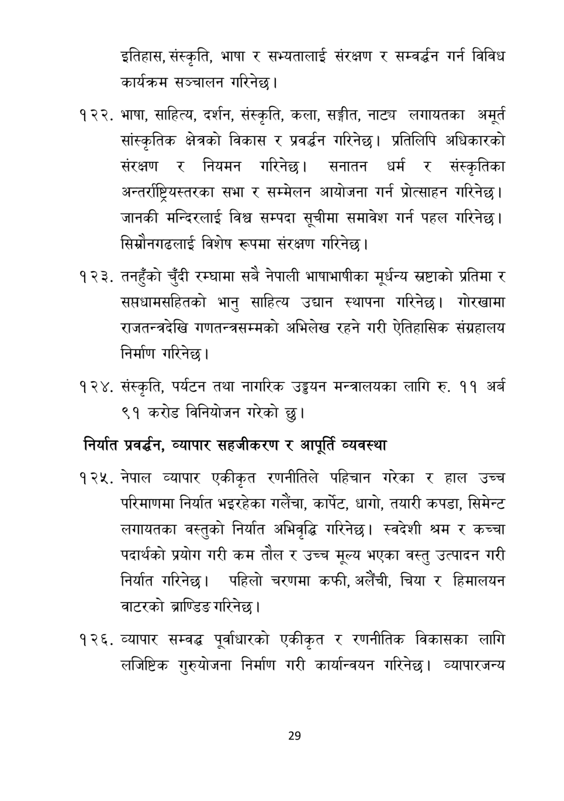

# Page 30 QA

## Rendered page


## Extracted text

```text
इतिहास, संस्कृति, भाषा र सभ्यतालाई संरक्षण र सम्वर्द्धन गर्न विविध कार्यक्रम सञ्चालन गरिनेछ |
भाषा, साहित्य, दर्शन, संस्कृति, कला, सङ्गीत, नाट्य लगायतका अमूर्त सांस्कृतिक क्षेत्रको विकास र प्रवर्द्धन गरिनेछ। प्रतिलिपि अधिकारको संरक्षण र नियमन गरिनेछ। सनातन धर्म र संस्कृतिका अन्तर्राष्ट्रियस्तरका सभा र सम्मेलन आयोजना गर्न प्रोत्साहन गरिनेछ। जानकी मन्दिरलाई विश्व सम्पदा सूचीमा समावेश गर्न पहल गरिनेछ। सिम्रौोनगढलाई विशेष रूपमा संरक्षण गरिनेछ।
तनहुँको चुँदी रम्घामा सबै नेपाली भाषाभाषीका मूर्धन्य स्रष्टाको प्रतिमा र सप्तघामसहितको भानु साहित्य उद्यान स्थापना गरिनेछ। गोरखामा राजतन्त्रदेखि गणतन्त्रसम्मको अभिलेख रहने गरी ऐतिहासिक संग्रहालय निर्माण गरिनेछ |
संस्कृति, पर्यटन तथा नागरिक उड्डयन मन्त्रालयका लागि रु. ११ अर्ब ९१ करोड विनियोजन गरेको छु।
निर्यात प्रवर्धन, व्यापार सहजीकरण र आपूर्ति व्यवस्था
नेपाल व्यापार एकीकृत रणनीतिले पहिचान गरेका र हाल उच्च परिमाणमा निर्यात भइरहेका गर्लैचा, कार्पट, धागो, तयारी कपडा, सिमेन्ट लगायतका वस्तुको निर्यात अभिवृद्धि गरिनेछ। स्वदेशी श्रम र कच्चा पदार्थको प्रयोग गरी कम तौल र उच्च मूल्य भएका वस्तु उत्पादन गरी निर्यात गरिनेछ। पहिलो चरणमा कफी, अलैँची, चिया र हिमालयन वाटरको ब्राण्डिङ गरिनेछ |
. व्यापार सम्वद्ध पूर्वाधारको एकीकृत र रणनीतिक विकासका लागि लजिष्टिक गुरुयोजना निर्माण गरी कार्यान्वयन गरिनेछ। व्यापारजन्य
२९
```

## Flags
- None
