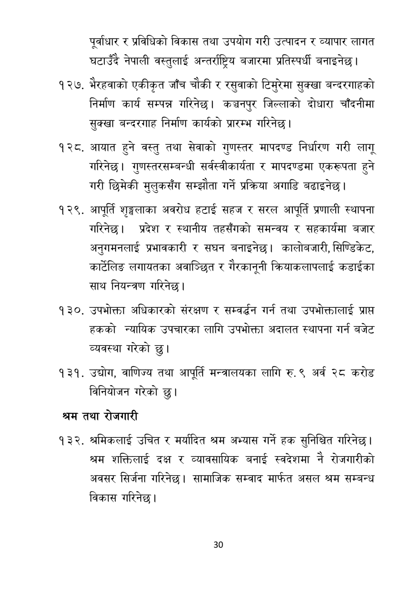

# Page 31 QA

## Rendered page


## Extracted text

```text
पूर्वाधार र प्रविधिको विकास तथा उपयोग गरी उत्पादन र व्यापार लागत घटाउँदै नेपाली वस्तुलाई अन्तर्राष्ट्रिय बजारमा प्रतिस्पर्धी बनाइनेछ |
भैरहवाको एकीकृत जाँच चौकी र रसुवाको टिमुरेमा सुक्खा बन्दरगाहको निर्माण कार्य सम्पन्न गरिनेछ। कञ्चनपुर जिल्लाको दोधारा चाँदनीमा सुक्खा बन्दरगाह निर्माण कार्यको प्रारम्भ गरिनेछ।
आयात हुने वस्तु तथा सेवाको गुणस्तर मापदण्ड निर्धारण गरी लागू गरिनेछ। गुणस्तरसम्बन्धी सर्वस्वीकार्यता र मापदण्डमा एकरूपता हुने गरी छिमेकी मुलुकसँग सम्झौता गर्ने प्रक्रिया अगाडि बढाइनेछ।
आपूर्ति शृङ्खलाका अवरोध हटाई सहज र सरल आपूर्ति प्रणाली स्थापना गरिनेछ। प्रदेश र स्थानीय तहसँगको समन्वय र सहकार्यमा बजार अनुगमनलाई प्रभावकारी र सघन बनाइनेछ। कालोबजारी, सिण्डिकेट, कार्टेलिङ लगायतका अवाञ्छित र गैरकानूनी क्रियाकलापलाई कडाईका साथ नियन्त्रण गरिनेछ |
उपभोक्ता अधिकारको संरक्षण र सम्वर्धन गर्न तथा उपभोक्तालाई प्राप्त हकको न्यायिक उपचारका लागि उपभोक्ता अदालत स्थापना गर्न बजेट व्यवस्था गरेको छु।
उद्योग, वाणिज्य तथा आपूर्ति मन्त्रालयका लागि रु. ९ अर्व २८ करोड विनियोजन गरेको छु।
श्रम तथा रोजगारी
श्रमिकलाई उचित र मर्यादित श्रम अभ्यास गर्ने हक सुनिश्चित गरिनेछ | श्रम शक्तिलाई दक्ष र व्यावसायिक बनाई स्वदेशमा नै रोजगारीको अवसर सिर्जना गरिनेछ। सामाजिक सम्वाद मार्फत असल श्रम सम्बन्ध विकास गरिनेछ |
३०
```

## Flags
- None
