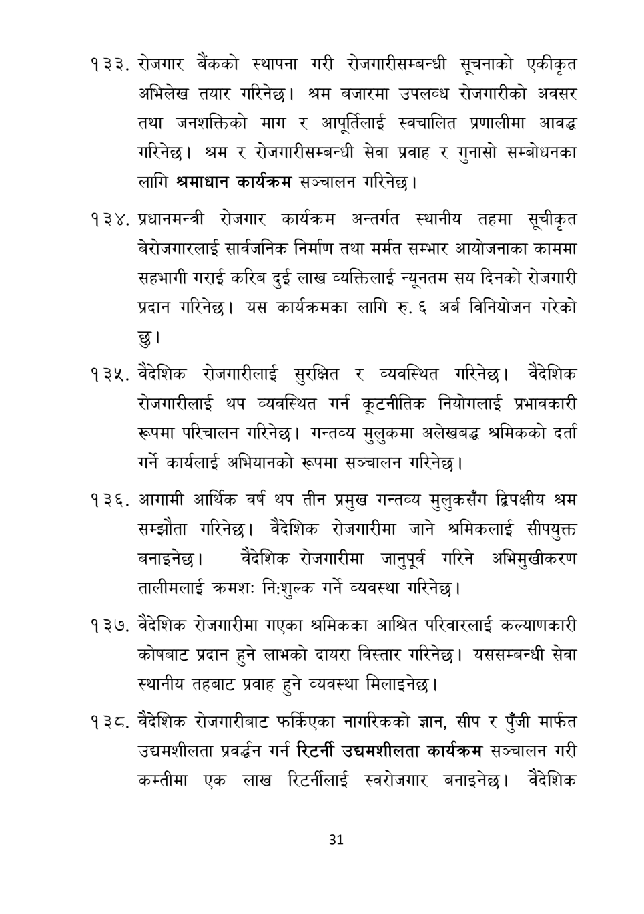

# Page 32 QA

## Rendered page


## Extracted text

```text
रोजगार बैंकको स्थापना गरी रोजगारीसम्बन्धी सूचनाको एकीकृत अभिलेख तयार गरिनेछ। श्रम बजारमा उपलव्ध रोजगारीको अवसर तथा जनशक्तिको माग र आपूर्तिलाई स्वचालित प्रणालीमा आवद्ध गरिनेछ। श्रम र रोजगारीसम्बन्धी सेवा प्रवाह र गुनासो सम्बोधनका लागि श्रमाधान कार्यक्रम सञ्चालन गरिनेछ।
प्रधानमन्त्री रोजगार कार्यक्रम अन्तर्गत स्थानीय तहमा सूचीकृत बेरोजगारलाई सार्वजनिक निर्माण तथा मर्मत सम्भार आयोजनाका काममा सहभागी गराई करिब दुई लाख व्यक्तिलाई न्यूनतम सय दिनको रोजगारी प्रदान गरिनेछ। यस कार्यक्रमका लागि रु. अर्ब विनियोजन गरेको छु।
वैदेशिक रोजगारीलाई सुरक्षित र व्यवस्थित गरिनेछ। वैदेशिक रोजगारीलाई थप व्यवस्थित गर्न कूटनीतिक नियोगलाई प्रभावकारी रूपमा परिचालन गरिनेछ। गन्तव्य मुलुकमा अलेखबद्ध श्रमिकको दर्ता गर्ने कार्यलाई अभियानको रूपमा सञ्चालन गरिनेछ।
. आगामी आर्थिक वर्ष थप तीन प्रमुख गन्तव्य मुलुकसँग द्विपक्षीय श्रम सम्झौता गरिनेछ। वैदेशिक रोजगारीमा जाने श्रमिकलाई सीपयुक्त बनाइनेछ। वैदेशिक रोजगारीमा जानुपूर्व गरिने अभिमुखीकरण तालीमलाई क्रमशः निःशुल्क गर्ने व्यवस्था गरिनेछ।
वेदेशिक रोजगारीमा गएका श्रमिकका आश्रित परिवारलाई कल्याणकारी कोषबाट प्रदान हुने लाभको दायरा विस्तार गरिनेछ। यससम्बन्धी सेवा स्थानीय तहबाट प्रवाह हुने व्यवस्था मिलाइनेछ |
वैदेशिक रोजगारीबाट फर्किएका नागरिकको ज्ञान, सीप र पुँजी मार्फत उद्यमशीलता प्रवर्द्धन गर्न रिटर्नी उद्यमशीलता कार्यक्रम सञ्चालन गरी कम्तीमा एक लाख रिटर्नीलाई स्वरोजगार बनाइनेछ। वैदेशिक
३१
```

## Flags
- None
