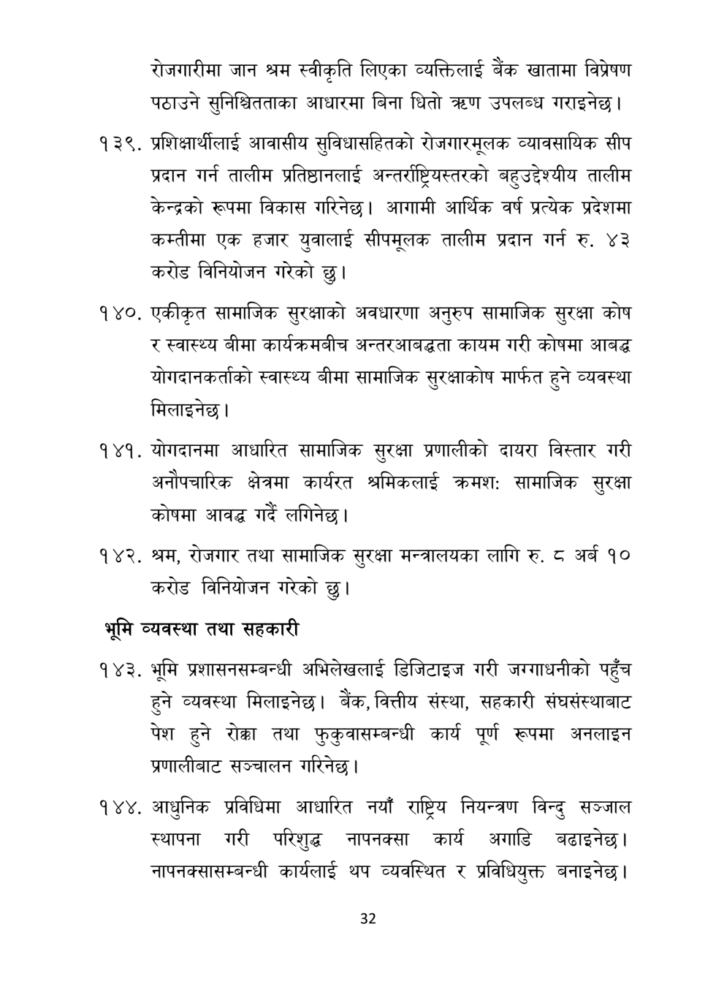

# Page 33 QA

## Rendered page


## Extracted text

```text
रोजगारीमा जान श्रम स्वीकृति लिएका व्यक्तिलाई बैंक खातामा विप्रेषण पठाउने सुनिश्चितताका आधारमा बिना घितो त्रहण उपलब्ध गराइनेछ |
प्रशिक्षार्थीलाई आवासीय सुविधासहितको रोजगारमूलक व्यावसायिक सीप प्रदान गर्न तालीम प्रतिष्ठानलाई अन्तर्राष्ट्रिय्तरको बहुउद्देश्यीय तालीम केन्द्रको रूपमा विकास गरिनेछ। आगामी आर्थिक वर्ष प्रत्येक प्रदेशमा कम्तीमा एक हजार युवालाई सीपमूलक तालीम प्रदान गर्न रु. ४३ करोड विनियोजन गरेको छु।
१४०, एकीकृत सामाजिक सुरक्षाको अवधारणा अनुरुप सामाजिक सुरक्षा कोष र स्वास्थ्य बीमा कार्यक्रमबीच अन्तरआबद्धता कायम गरी कोषमा आबद्ध योगदानकर्ताको स्वास्थ्य बीमा सामाजिक सुरक्षाकोष मार्फत हुने व्यवस्था मिलाइनेछ |
योगदानमा आधारित सामाजिक सुरक्षा प्रणालीको दायरा विस्तार गरी अनौपचारिक क्षेत्रमा कार्यरत श्रमिकलाई क्रमशः सामाजिक सुरक्षा कोषमा आवद्ध गर्दै लगिनेछ।
१४२, श्रम, रोजगार तथा सामाजिक सुरक्षा मन्त्रालयका लागि रु. अर्ब १० करोड विनियोजन गरेको छु।
भूमि व्यवस्था तथा सहकारी
भूमि प्रशासनसम्बन्धी अभिलेखलाई डिजिटाइज गरी जरगाधनीको पहुँच हुने व्यवस्था मिलाइनेछ। बैंक, वित्तीय संस्था, सहकारी संघसंस्थाबाट पेश हुने रोक्का तथा फुकुवासम्बन्धी कार्य पूर्ण रूपमा अनलाइन प्रणालीबाट सञ्चालन गरिनेछ |
१४४, आधुनिक प्रविधिमा आधारित नयाँ राष्ट्रिय नियन्त्रण विन्दु सञ्जाल स्थापना गरी परिशुद्ध नापनक्सा कार्य अगाडि बढाइनेछ | नापनक्सासम्बन्धी कार्यलाई थप व्यवस्थित र प्रविधियुक्त बनाइनेछ |
३२
```

## Flags
- None
