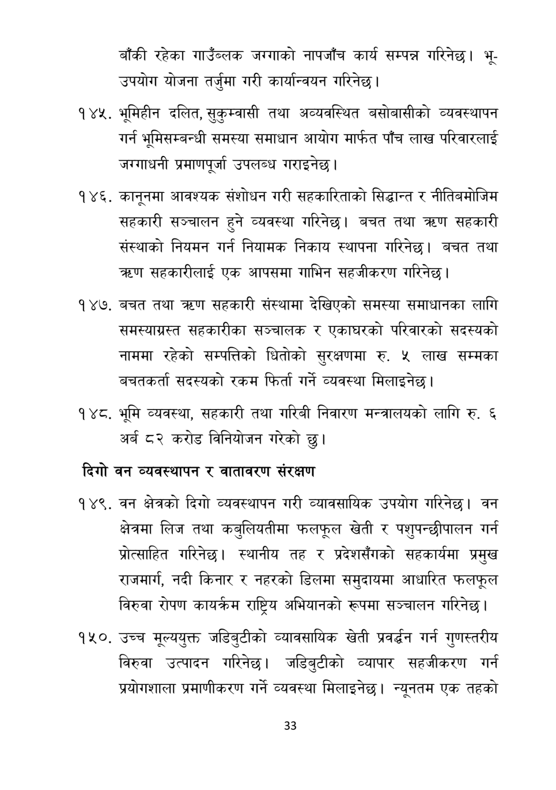

# Page 34 QA

## Rendered page


## Extracted text

```text
बाँकी रहेका गाउँब्लक जग्गाको नापजाँच कार्य सम्पन्न गरिनेछ। भूउपयोग योजना तर्जुमा गरी कार्यान्वयन गरिनेछ।
भूमिहीन दलित, सुकुम्वासी तथा अव्यवस्थित बसोबासीको व्यवस्थापन गर्न भूमिसम्बन्धी समस्या समाधान आयोग मार्फत पाँच लाख परिवारलाई जग्गाधनी प्रमाणपूर्जा उपलब्ध गराइनेछ |
कानूनमा आवश्यक संशोधन गरी सहकारिताको सिद्धान्त र नीतिबमोजिम सहकारी सञ्चालन हुने व्यवस्था गरिनेछ। बचत तथा त्रहण सहकारी संस्थाको नियमन गर्न नियामक निकाय स्थापना गरिनेछ। बचत तथा त्रहण सहकारीलाई एक आपसमा गाभिन सहजीकरण गरिनेछ |
बचत तथा क्रण सहकारी संस्थामा देखिएको समस्या समाधानका लागि समस्याग्रस्त सहकारीका सञ्चालक र एकाघरको परिवारको सदस्यको नाममा रहेको सम्पत्तिको धितोको सुरक्षणमा रु. ५ लाख सम्मका बचतकर्ता सदस्यको रकम फिर्ता गर्ने व्यवस्था मिलाइनेछ |
भूमि व्यवस्था, सहकारी तथा गरिबी निवारण मन्त्रालयको लागि रु. ६ अर्ब ८२ करोड विनियोजन गरेको छु।
दिगो वन व्यवस्थापन र वातावरण संरक्षण
वन क्षेत्रको दिगो व्यवस्थापन गरी व्यावसायिक उपयोग गरिनेछु। वन क्षेत्रमा लिज तथा कबुलियतीमा फलफूल खेती र पशुपन्छीपालन गर्न प्रोत्साहित गरिनेछ। स्थानीय तह र प्रदेशसँगको सहकार्यमा प्रमुख राजमार्ग, नदी किनार र नहरको डिलमा समुदायमा आधारित फलफूल विरुवा रोपण कायम राष्ट्रिय अभियानको रूपमा सञ्चालन गरिनेछ।
उच्च मूल्ययुक्त जडिबुटीको व्यावसायिक खेती प्रवर्द्धन गर्न गुणस्तरीय विरुवा उत्पादन गरिनेछ। जडिबुटीको व्यापार सहजीकरण गर्न प्रयोगशाला प्रमाणीकरण गर्ने व्यवस्था मिलाइनेछ। न्यूनतम एक तहको
३३
```

## Flags
- None
