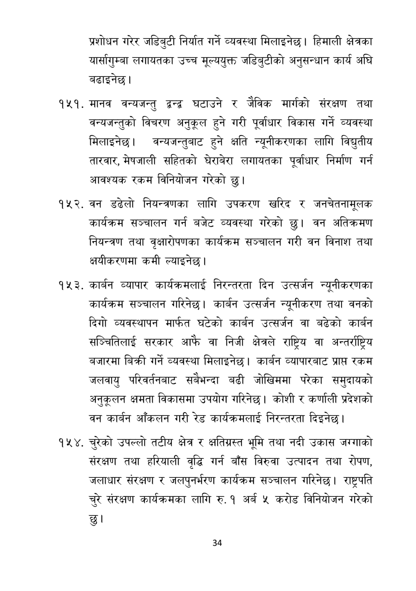

# Page 35 QA

## Rendered page


## Extracted text

```text
प्रशोधन गरेर जडिबुटी निर्यात गर्ने व्यवस्था मिलाइनेछ। हिमाली क्षेत्रका यार्सागुम्बा लगायतका उच्च मूल्ययुक्त जडिबुटीको अनुसन्धान कार्य अघि बढाइनेछ |
मानव वन्यजन्तु द्वन्द्व घटाउने र जैविक मार्गको संरक्षण तथा वन्यजन्तुको विचरण अनुकूल हुने गरी पूर्वाधार विकास गर्ने व्यवस्था मिलाइनेछ। वन्यजन्तुबाट हुने क्षति न्यूनीकरणका लागि विद्युतीय तारवार, मेषजाली सहितको घेराबेरा लगायतका पूर्वाधार निर्माण गर्न आवश्यक रकम विनियोजन गरेको छु।
वन डढेलो नियन्त्रणका लागि उपकरण खरिद र जनचेतनामूलक कार्यक्रम सञ्चालन गर्न बजेट व्यवस्था गरेको वन अतिक्रमण नियन्त्रण तथा वृक्षारोपणका कार्यक्रम सञ्चालन गरी वन विनाश तथा क्षयीकरणमा कमी ल्याइनेछ |
कार्बन व्यापार कार्यक्रमलाई निरन्तरता दिन उत्सर्जन न्यूनीकरणका कार्यक्रम सञ्चालन गरिनेछ। कार्बन उत्सर्जन न्यूनीकरण तथा वनको दिगो व्यवस्थापन मार्फत घटेको कार्बन उत्सर्जन वा बढेको कार्बन सञ्चितिलाई सरकार आफै वा निजी क्षेत्रले राष्ट्रिय वा अन्तर्राष्ट्रिय बजारमा बिक्री गर्ने व्यवस्था मिलाइनेछ। कार्बन व्यापारबाट प्राप्त रकम जलवायु परिवर्तनबाट सबैभन्दा बढी जोखिममा परेका समुदायको अनुकूलन क्षमता विकासमा उपयोग गरिनेछ। कोशी र कर्णाली प्रदेशको वन कार्बन आँकलन गरी रेड कार्यक्रमलाई निरन्तरता दिइनेछ।
चुरेको उपल्लो तटीय क्षेत्र र क्षतिग्रस्त भूमि तथा नदी उकास जग्गाको संरक्षण तथा हरियाली वृद्धि गर्न बाँस विरुवा उत्पादन तथा रोपण, जलाधार संरक्षण र जलपुनर्भरण कार्यक्रम सञ्चालन गरिनेछ। राष्ट्रपति चुरे संरक्षण कार्यक्रमका लागि रु. १ अर्ब ५ करोड विनियोजन गरेको छु।
३४
```

## Flags
- None
