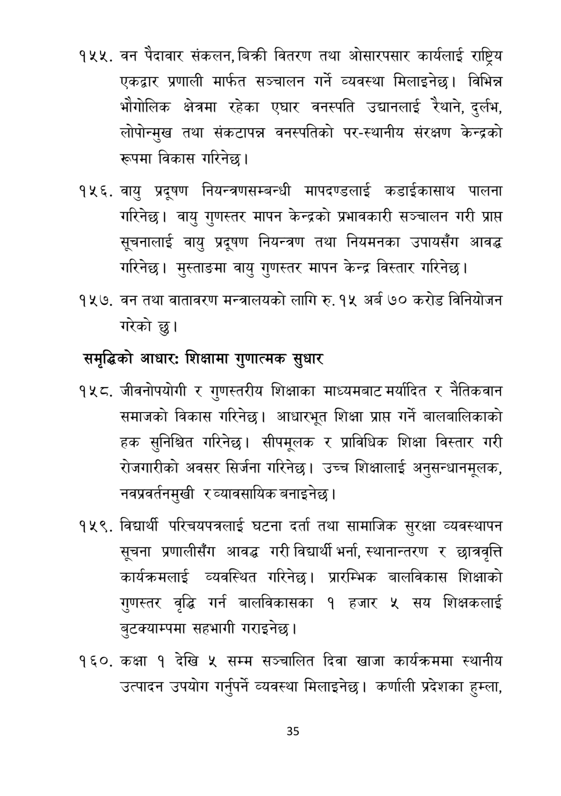

# Page 36 QA

## Rendered page


## Extracted text

```text
वन पैदावार संकलन, बिक्री वितरण तथा ओसारपसार कार्यलाई राष्ट्रिय एकद्वार प्रणाली मार्फत सञ्चालन गर्ने व्यवस्था मिलाइनेछ। विभिन्न भौगोलिक क्षेत्रमा रहेका एघार वनस्पति उद्यानलाई रेथाने, दुर्लभ, लोपोन्मुख तथा संकटापन्न वनस्पतिको पर-स्थानीय संरक्षण केन्द्रको रूपमा विकास गरिनेछ |
वायु प्रदूषण नियन्त्रणसम्बन्धी मापदण्डलाई कडाईकासाथ पालना गरिनेछ। वायु गुणस्तर मापन केन्द्रको प्रभावकारी सञ्चालन गरी प्राप्त सूचनालाई वायु प्रदूषण नियन्त्रण तथा नियमनका उपायसँग आवद्ध गरिनेछ। मुस्ताङमा वायु गुणस्तर मापन केन्द्र विस्तार गरिनेछ |
वन तथा वातावरण मन्त्रालयको लागि रु. १५ अर्ब ७० करोड विनियोजन गरेको छु।
समृद्धिको आधार: शिक्षामा गुणात्मक सुधार
जीवनोपयोगी र गुणस्तरीय शिक्षाका माध्यमबाट मर्यादित र नैतिकवान समाजको विकास गरिनेछ। आधारभूत शिक्षा प्राप्त गर्ने बालबालिकाको हक सुनिश्चित गरिनेछ। सीपमूलक र प्राविधिक शिक्षा विस्तार गरी रोजगारीको अवसर सिर्जना गरिनेछ। उच्च शिक्षालाई अनुसन्धानमूलक, नवप्रवर्तनमुखी र व्यावसायिक बनाइनेछ |
विद्यार्थी परिचयपत्रलाई घटना दर्ता तथा सामाजिक सुरक्षा व्यवस्थापन सूचना प्रणालीसँग आवद्ध गरी विद्यार्थी भर्ना, स्थानान्तरण र छात्रवृत्ति कार्यक्रमलाई व्यवस्थित गरिनेछ। प्रारम्भिक बालविकास शिक्षाको गुणस्तर वृद्धि गर्न बालविकासका १ हजार ५ सय शिक्षकलाई बुटक्याम्पमा सहभागी गराइनेछ |
कक्षा १ देखि ५ सम्म सञ्चालित दिवा खाजा कार्यक्रममा स्थानीय उत्पादन उपयोग गर्नुपर्ने व्यवस्था मिलाइनेछ। कर्णाली प्रदेशका हुम्ला,
३५
```

## Flags
- None
