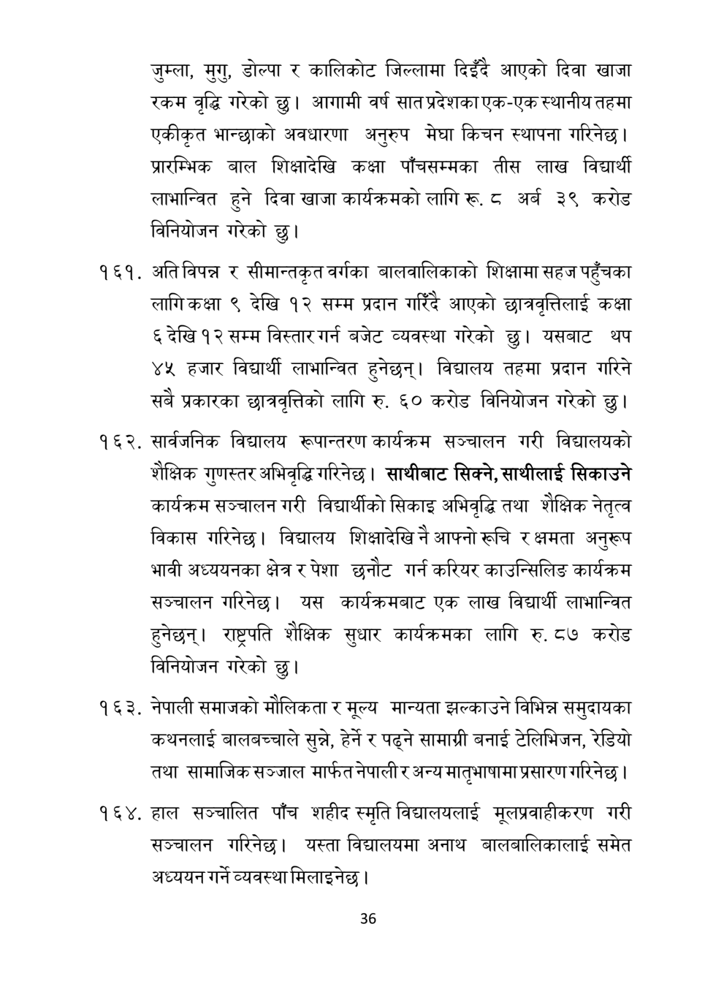

# Page 37 QA

## Rendered page


## Extracted text

```text
जुम्ला, मुगु, डोल्पा र कालिकोट जिल्लामा दिइँदै आएको दिवा खाजा रकम वृद्धि गरेको छु। आगामी वर्ष सात प्रदेशका एक-एक स्थानीय तहमा एकीकृत भान्छाको अवधारणा अनुरुप मेघा किचन स्थापना गरिनेछ | प्रारम्भिक बाल शिक्षादेखि कक्षा पाँचसम्मका तीस लाख विद्यार्थी लाभान्वित हुने दिवा खाजा कार्यक्रमको लागि रू. ८ अर्ब ३९ करोड विनियोजन गरेको छु।
. अतिविपन्न र सीमान्तकृत वर्गका बालवालिकाको शिक्षामा सहज पहुँचका लागिकक्षा ९ देखि १२ सम्म प्रदान गरिँदै आएको छात्रवृत्तिलाई कक्षा ६देखि १२ सम्म विस्तारगर्न बजेट व्यवस्था गरेको छु। यसबाट थप ४५ हजार विद्यार्थी लाभान्वित हुनेछन्‌। विद्यालय तहमा प्रदान गरिने सबै प्रकारका छात्रवृत्तिको लागि रु. ६० करोड विनियोजन गरेको छु।
सार्वजनिक विद्यालय रूपान्तरण कार्यक्रम सञ्चालन गरी विद्यालयको शैक्षिक गुणस्तर अभिवृद्धि गरिनेछ | साथीबाट सिक्ने, साथीलाई सिकाउने कार्यक्रम सञ्चालन गरी विद्यार्थीको सिकाइ अभिवृद्धि तथा शैक्षिक नेतृत्व विकास गरिनेछ। विद्यालय शिक्षादेखि नै आफ्नो रूचि र क्षमता अनुरूप भावी अध्ययनका क्षेत्र र पेशा छनौट गर्न करियर काउन्सिलिङ कार्यक्रम सञ्चालन गरिनेछ। यस कार्यक्रमबाट एक लाख विद्यार्थी लाभान्वित हुनेछन्‌। राष्ट्रपति शैक्षिक सुधार कार्यक्रमका लागि रु. ८७ करोड विनियोजन गरेको छु।
नेपाली समाजको मौलिकता र मूल्य मान्यता झल्काउने विभिन्न समुदायका कथनलाई बालबच्चाले सुन्ने, हेर्ने र पढ्ने सामाग्री बनाई टेलिभिजन, रेडियो तथा सामाजिक सञ्जाल मार्फत नेपाली र अन्य मातृभाषामा प्रसारण गरिनेछ |
हाल सञ्चालित पाँच शहीद स्मृति विद्यालयलाई मूलप्रवाहीकरण गरी सञ्चालन गरिनेछ। यस्ता विद्यालयमा अनाथ बालबालिकालाई समेत अध्ययन गर्ने व्यवस्था मिलाइनेछ |
३६
```

## Flags
- None
