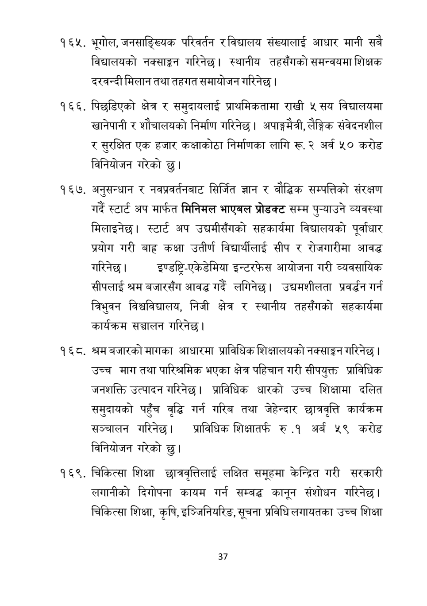

# Page 38 QA

## Rendered page


## Extracted text

```text
भूगोल, जनसाङ्ख्यिक परिवर्तन रविद्यालय संख्यालाई आधार मानी सबै विद्यालयको नक्साङ्कन गरिनेछ। स्थानीय तहसँगको समन्वयमा शिक्षक दरवन्दी मिलान तथा तहगत समायोजन गरिनेछ |
. पिछडिएको क्षेत्र र समुदायलाई प्राथमिकतामा राखी ५ सय विद्यालयमा खानेपानी र शोचालयको निर्माण गरिनेछ। अपाङ्गमैत्री, लैङ्गिक संवेदनशील र सुरक्षित एक हजार कक्षाकोठा निर्माणका लागि रू. २ अर्व ५० करोड विनियोजन गरेको छु।
१६७, अनुसन्धान र नवप्रवर्तनबाट सिर्जित ज्ञान र बौद्धिक सम्पत्तिको संरक्षण गर्दै स्टार्ट अप मार्फत मिनिमल भाएबल प्रोडक्ट सम्म पु-याउने व्यवस्था मिलाइनेछ। स्टार्ट अप उद्यमीसँगको सहकार्यमा विद्यालयको पूर्वाधार प्रयोग गरी बाह्र कक्षा उतीर्ण विद्यार्थीलाई सीप र रोजगारीमा आवद्ध गरिनेछ | इण्डष्टि-एकेडेमिया इन्टरफेस आयोजना गरी व्यवसायिक सीपलाई श्रम बजारसँग आवद्ध गर्दे लगिनेछ। उद्यमशीलता प्रवर्द्धन गर्न त्रिभुवन विश्वविद्यालय, निजी क्षेत्र र स्थानीय तहसँगको सहकार्यमा कार्यक्रम सञ्चालन गरिनेछ।
श्रम बजारको मागका आधारमा प्राविधिक शिक्षालयको नक्साङ्कन गरिनेछ | उच्च माग तथा पारिश्रमिक भएका क्षेत्र पहिचान गरी सीपयुक्त प्राविधिक जनशक्ति उत्पादन गरिनेछ। प्राविधिक धारको उच्च शिक्षामा दलित समुदायको पहुँच वृद्धि गर्न गरिब तथा जेहेन्दार छात्रवृत्ति कार्यक्रम सञ्चालन गरिनेछ। प्राविधिक शिक्षातर्फ रु.१ अर्ब ५९ करोड विनियोजन गरेको छु।
चिकित्सा शिक्षा छात्रवृत्तिलाई लक्षित समूहमा केन्द्रित गरी सरकारी लगानीको दिगोपना कायम गर्न सम्बद्ध कानून संशोधन गरिनेछ। चिकित्सा शिक्षा, कृषि, इञ्जिनियरिङ, सूचना प्रविधि लगायतका उच्च शिक्षा
३७
```

## Flags
- None
