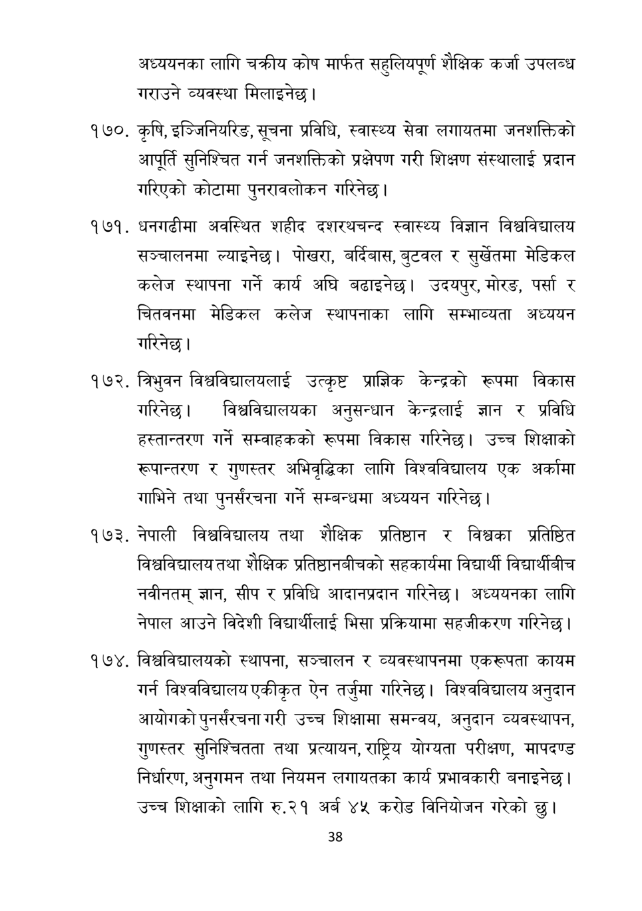

# Page 39 QA

## Rendered page


## Extracted text

```text
अध्ययनका लागि चक्रीय कोष मार्फत सहुलियपूर्ण शैक्षिक कर्जा उपलब्ध गराउने व्यवस्था मिलाइनेछ |
कृषि, इञ्जिनियरिङ, सूचना प्रविधि, स्वास्थ्य सेवा लगायतमा जनशक्तिको आपूर्ति सुनिश्चित गर्न जनशक्तिको प्रक्षेपण गरी शिक्षण संस्थालाई प्रदान गरिएको कोटामा पुनरावलोकन गरिनेछ |
धनगढीमा अवस्थित शहीद दशरथचन्द स्वास्थ्य विज्ञान विश्वविद्यालय सञ्चालनमा ल्याइनेछ। पोखरा, बर्दिबास, बुटवल र सुर्खेतमा मेडिकल कलेज स्थापना गर्ने कार्य अघि बढाइनेछ। उदयपुर, मोरङ, पर्सा र चितवनमा मेडिकल कलेज स्थापनाका लागि सम्भाव्यता अध्ययन गरिनेछ।
. व्रिभुवन विश्वविद्यालयलाई उत्कृष्ट प्राज्ञिक केन्द्रको रूपमा विकास गरिनेछ। विश्वविद्यालयका अनुसन्धान केन्द्रलाई ज्ञान र प्रविधि हस्तान्तरण गर्ने सम्वाहकको रूपमा विकास गरिनेछ। उच्च शिक्षाको रूपान्तरण र गुणस्तर अभिवृद्धिका लागि विश्वविद्यालय एक अर्कामा गाभिने तथा पुनर्संरचना गर्ने सम्बन्धमा अध्ययन गरिनेछ।
नेपाली विश्वविद्यालय तथा शैक्षिक प्रतिष्ठान र विश्वका प्रतिष्ठित विश्वविद्यालय तथा शैक्षिक प्रतिष्ठानबीचको सहकार्यमा विद्यार्थी विद्यार्थीबीच नवीनतम्‌ ज्ञान, सीप र प्रविधि आदानप्रदान गरिनेछ। अध्ययनका लागि नेपाल आउने विदेशी विद्यार्थीलाई भिसा प्रक्रियामा सहजीकरण गरिनेछ |
विश्वविद्यालयको स्थापना, सञ्चालन र व्यवस्थापनमा एकरूपता कायम गर्न विश्वविद्यालय एकीकृत ऐन तर्जुमा गरिनेछ। विश्वविद्यालय अनुदान आयोगको पुनर्संरचना गरी उच्च शिक्षामा समन्वय, अनुदान व्यवस्थापन, गुणस्तर सुनिश्चितता तथा प्रत्यायन, राष्ट्रिय योग्यता परीक्षण, मापदण्ड निर्धारण, अनुगमन तथा नियमन लगायतका कार्य प्रभावकारी बनाइनेछ | उच्च शिक्षाको लागि रु.२१ अर्ब ४५ करोड विनियोजन गरेको छु।
३८
```

## Flags
- None
