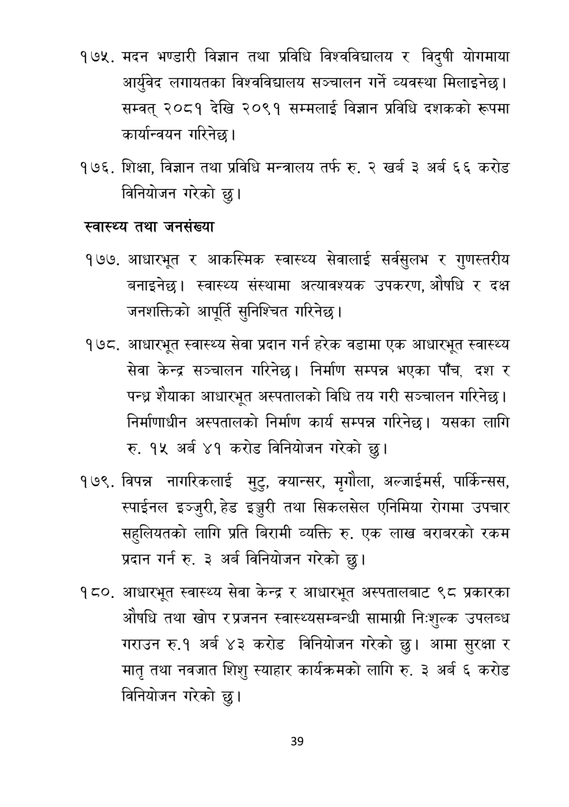

# Page 40 QA

## Rendered page


## Extracted text

```text
मदन भण्डारी विज्ञान तथा प्रविधि विश्वविद्यालय र विदुषी योगमाया आर्युवेद लगायतका विश्वविद्यालय सञ्चालन गर्ने व्यवस्था मिलाइनेछ। सम्वत्‌ २०८१ देखि २०९१ सम्मलाई विज्ञान प्रविधि दशकको रूपमा कार्यान्वयन गरिनेछ |
शिक्षा, विज्ञान तथा प्रविधि मन्त्रालय तर्फ रु. २ खर्ब ३ अर्ब ६६ करोड विनियोजन गरेको छु।
स्वास्थ्य तथा जनसंख्या
आधारभूत र आकस्मिक स्वास्थ्य सेवालाई सर्वसुलभ र गुणस्तरीय बनाइनेछ। स्वास्थ्य संस्थामा अत्यावश्यक उपकरण, औषधि र दक्ष जनशक्तिको आपूर्ति सुनिश्चित गरिनेछ |
आधारभूत स्वास्थ्य सेवा प्रदान गर्न हरेक वडामा एक आधारभूत स्वास्थ्य सेवा केन्द्र सञ्चालन गरिनेछ। निर्माण सम्पन्न भएका पाँच, दश र पन्ध्र शीयाका आधारभूत अस्पतालको विधि तय गरी सञ्चालन गरिनेछ | निर्माणाधीन अस्पतालको निर्माण कार्य सम्पन्न गरिनेछ। यसका लागि रु. १५ अर्ब ४१ करोड विनियोजन गरेको छु।
१७९, विपन्न नागरिकलाई मुटु, क्यान्सर, मृगौला, अल्जाईमर्स, पार्किन्सस, स्पाईनल इञ्जुरी, हेड इञ्जरी तथा सिकलसेल एनिमिया रोगमा उपचार सहुलियतको लागि प्रति बिरामी व्यक्ति रु. एक लाख बराबरको रकम प्रदान गर्न रु. ३ अर्ब विनियोजन गरेको छु।
आधारभूत स्वास्थ्य सेवा केन्द्र र आधारभूत अस्पतालबाट ९८ प्रकारका औषधि तथा खोप रप्रजनन स्वास्थ्यसम्बन्धी सामाग्री निःशुल्क उपलब्ध गराउन रु.१ अर्ब ४३ करोड विनियोजन गरेको छु। आमा सुरक्षा र मातृ तथा नवजात शिशु स्याहार कार्यक्रमको लागि रु. ३ अर्ब ६ करोड विनियोजन गरेको छु।
३९
```

## Flags
- None
