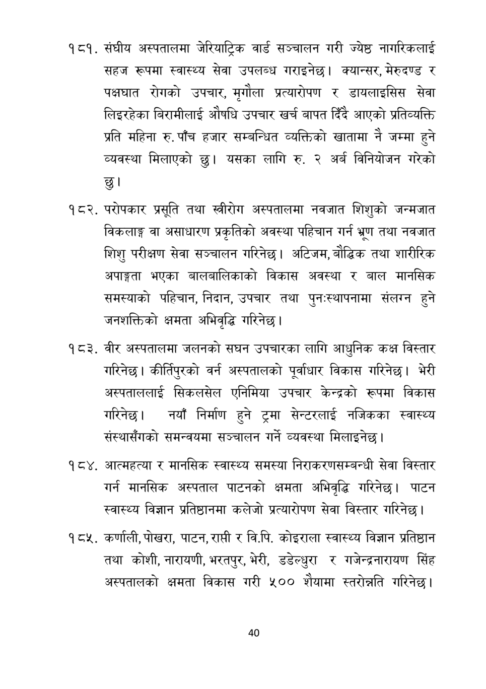

# Page 41 QA

## Rendered page


## Extracted text

```text
संघीय अस्पतालमा जेरियाट्रिक वार्ड सञ्चालन गरी ज्येष्ठ नागरिकलाई सहज रूपमा स्वास्थ्य सेवा उपलब्ध गराइनेछ। क्यान्सर, मेरुदण्ड र पक्षघात रोगको उपचार, मृगौला प्रत्यारोपण र डायलाइसिस सेवा लिइरहेका बिरामीलाई औषधि उपचार खर्च बापत दिँदै आएको प्रतिव्यक्ति प्रति महिना रु. पाँच हजार सम्बन्धित व्यक्तिको खातामा नै जम्मा हुने व्यवस्था मिलाएको छु। यसका लागि रु. २ अर्ब विनियोजन गरेको
परोपकार प्रसूृति तथा स्रीरोग अस्पतालमा नवजात शिशुको जन्मजात विकलाङ्ग वा असाधारण प्रकृतिको अवस्था पहिचान गर्न भ्रुण तथा नवजात शिशु परीक्षण सेवा सञ्चालन गरिनेछ। अटिजम, बौद्धिक तथा शारीरिक अपाङ्गता भएका बालबालिकाको विकास अवस्था र बाल मानसिक समस्याको पहिचान, निदान, उपचार तथा पुनःस्थापनामा संलग्न हुने जनशक्तिको क्षमता अभिवृद्धि गरिनेछ।
वीर अस्पतालमा जलनको सघन उपचारका लागि आधुनिक कक्ष विस्तार गरिनेछ। कीर्तिपुरको वर्न अस्पतालको पूर्वाधार विकास गरिनेछ। भेरी अस्पताललाई सिकलसेल एनिमिया उपचार केन्द्रको रूपमा विकास गरिनेछ। नयाँ निर्माण हुने ट्रमा सेन्टरलाई नजिकका स्वास्थ्य संस्थासँगको समन्वयमा सञ्चालन गर्ने व्यवस्था मिलाइनेछ |
आत्महत्या र मानसिक स्वास्थ्य समस्या निराकरणसम्बन्धी सेवा विस्तार गर्न मानसिक अस्पताल पाटनको क्षमता अभिवृद्धि गरिनेछ। पाटन स्वास्थ्य विज्ञान प्रतिष्ठानमा कलेजो प्रत्यारोपण सेवा विस्तार गरिनेछ |
१ टर. कर्णाली, पोखरा, पाटन, राप्ती र वि.पि. कोइराला स्वास्थ्य विज्ञान प्रतिष्ठान तथा कोशी, नारायणी, भरतपुर, भेरी, डडेल्धुरा र गजेन्द्रनारायण सिंह अस्पतालको क्षमता विकास गरी ५०० शैयामा स्तरोन्नति गरिनेछ।
४०
```

## Flags
- None
