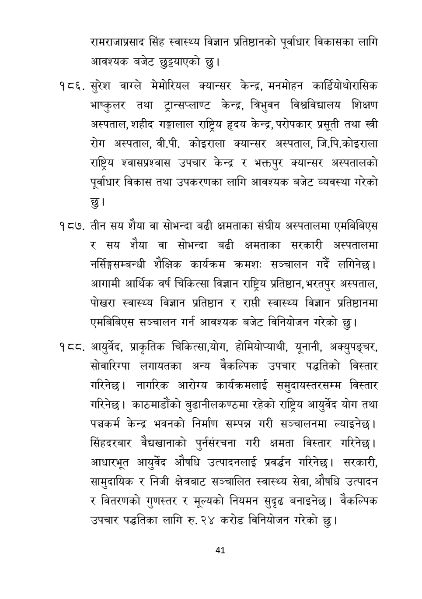

# Page 42 QA

## Rendered page


## Extracted text

```text
रामराजाप्रसाद सिंह स्वास्थ्य विज्ञान प्रतिष्ठानको पूर्वाधार विकासका लागि आवश्यक बजेट छुट्टयाएको छु।
सुरेश वाग्ले मेमोरियल क्यान्सर केन्द्र, मनमोहन कार्डियोथोरासिक भाष्कुलर तथा ट्रान्सप्लाण्ट केन्द्र, त्रिभुवन विश्वविद्यालय शिक्षण अस्पताल, शहीद गङ्गालाल राष्ट्रिय हृदय केन्द्र, परोपकार प्रसूती तथा स्त्री रोग अस्पताल, वी.पी. कोइराला क्यान्सर अस्पताल, जि.पि.कोइराला राष्ट्रिय श्वासप्रश्वास उपचार केन्द्र र भक्तपुर क्यान्सर अस्पतालको पूर्वाधार विकास तथा उपकरणका लागि आवश्यक बजेट व्यवस्था गरेको छु।
तीन सय शैया वा सोभन्दा बढी क्षमताका संघीय अस्पतालमा एमबिबिएस र सय शैया वा सोभन्दा बढी क्षमताका सरकारी अस्पतालमा नर्सिङ्गसम्बन्धी शैक्षिक कार्यक्रम क्रमशः सञ्चालन गर्दै लगिनेछ | आगामी आर्थिक वर्ष चिकित्सा विज्ञान राष्ट्रिय प्रतिष्ठान, भरतपुर अस्पताल, पोखरा स्वास्थ्य विज्ञान प्रतिष्ठान र राप्ती स्वास्थ्य विज्ञान प्रतिष्ठानमा एमबिबिएस सञ्चालन गर्न आवश्यक बजेट विनियोजन गरेको छु।
. आयुर्वेद, प्राकृतिक चिकित्सा,योग, होमियोप्याथी, यूनानी, अक्युपङ्चर, सोवारिग्पा लगायतका अन्य वैकल्पिक उपचार पद्धतिको विस्तार गरिनेछ। नागरिक आरोग्य कार्यक्रमलाई समुदायस्तरसम्म विस्तार गरिनेछ। काठमाडौंको बुढानीलकण्ठमा रहेको राष्ट्रिय आयुर्वेद योग तथा पञ्चकर्म केन्द्र भवनको निर्माण सम्पन्न गरी सञ्चालनमा ल्याइनेछ। सिंहदरबार वैद्यवानाको पुर्नसंरचना गरी क्षमता विस्तार गरिनेछ। आधारभूत आयुर्वेद औषधि उत्पादनलाई प्रवर्धन गरिनेछ। सरकारी, सामुदायिक र निजी क्षेत्रबाट सञ्चालित स्वास्थ्य सेवा, औषधि उत्पादन र वितरणको गुणस्तर र मूल्यको नियमन सुदृढ बनाइनेछ। वैकल्पिक उपचार पद्धतिका लागि रु. २४ करोड विनियोजन गरेको छु।
४१
```

## Flags
- None
