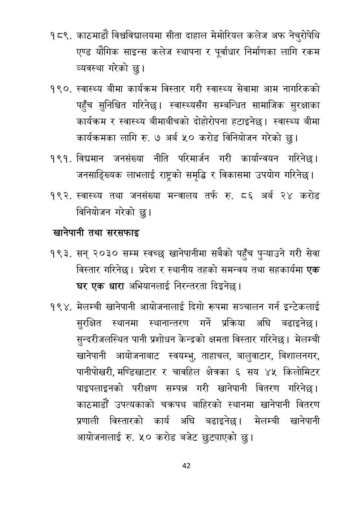

# Page 43 QA

## Rendered page


## Extracted text

```text
काठमाडौं विश्वविद्यालयमा सीता दाहाल मेमोरियल कलेज अफ नेचुरोपेथि एण्ड यौगिक साइन्स कलेज स्थापना र पूर्वाधार निर्माणका लागि रकम व्यवस्था गरेको छु।
स्वास्थ्य बीमा कार्यक्रम विस्तार गरी स्वास्थ्य सेवामा आम नागरिकको पहुँच सुनिश्चित गरिनेछ। स्वास्थ्यसँग सम्बन्धित सामाजिक सुरक्षाका कार्यक्रम र स्वास्थ्य बीमाबीचको दोहोरोपना हटाइनेछ। स्वास्थ्य बीमा कार्यक्रमका लागि रु. ७ अर्ब ५० करोड विनियोजन गरेको छु।
. विद्यमान जनसंख्या नीति परिमार्जन गरी कार्यान्वयन गरिनेछ। जनसाङ्ख्यिक लाभलाई राष्ट्रको समृद्धि र विकासमा उपयोग गरिनेछ।
स्वास्थ्य तथा जनसंख्या मन्त्रालय तर्फ रु. ८६ अर्ब २४ करोड विनियोजन गरेको
छु।
खानेपानी तथा सरसफाइ
सन्‌ २०३० सम्म स्वच्छ खानेपानीमा सबैको पहुँच पुन्याउने गरी सेवा विस्तार गरिनेछ। प्रदेश र स्थानीय तहको समन्वय तथा सहकार्यमा एक घर एक धारा अभियानलाई निरन्तरता दिइनेछ |
मेलम्ची खानेपानी आयोजनालाई दिगो रूपमा सञ्चालन गर्न इन्टेकलाई सुरक्षित स्थानमा स्थानान्तरण गर्ने प्रक्रिया अघि बढाइनेछ। सुन्दरीजलस्थित पानी प्रशोधन केन्द्रको क्षमता विस्तार गरिनेछ। मेलम्ची खानेपानी आयोजनाबाट स्वयम्भु, ताहाचल, बालुवाटार, विशालनगर, पानीपोखरी, मण्डिखाटार र चावहिल क्षेत्रका ६ सय ४५ किलोमिटर पाइपलाइनको परीक्षण सम्पन्न गरी खानेपानी वितरण गरिनेछ। काठमाडौं उपत्यकाको चक्रपथ बाहिरको स्थानमा खानेपानी वितरण प्रणाली विस्तारको कार्य अघि बढाइनेछ। मेलम्ची खानेपानी आयोजनालाई रु. ५० करोड बजेट छुट्याएको छु।
४२
```

## Flags
- None
