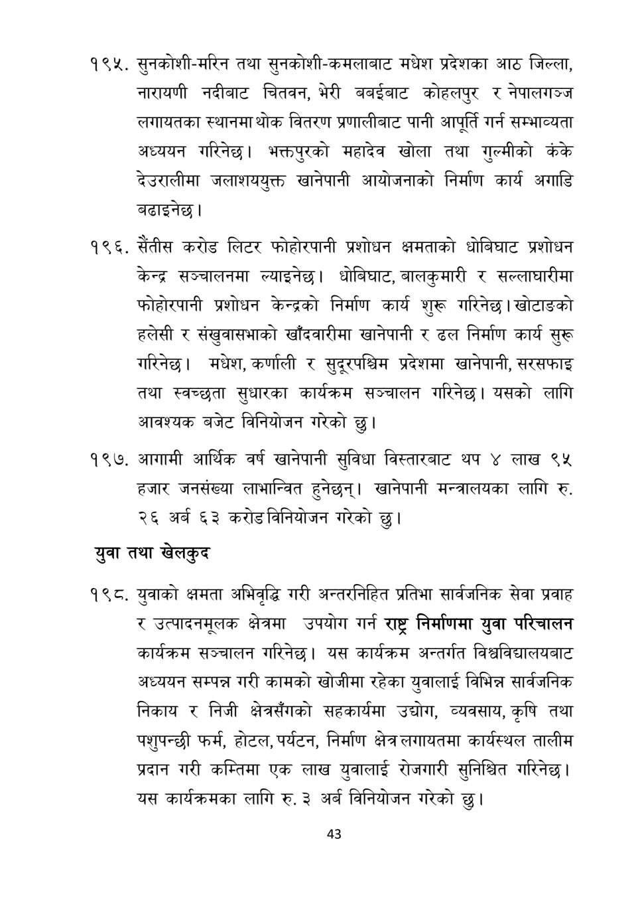

# Page 44 QA

## Rendered page


## Extracted text

```text
सुनकोशी-मरिन तथा सुनकोशी-कमलाबाट मधेश प्रदेशका आठ जिल्ला, नारायणी नदीबाट चितवन, भेरी बबईबाट कोहलपुर र नेपालगञ्ज लगायतका स्थानमा थोक वितरण प्रणालीबाट पानी आपूर्ति गर्न सम्भाव्यता अध्ययन गरिनेछ। भक्तपुरको महादेव खोला तथा गुल्मीको कंके देउरालीमा जलाशययुक्त खानेपानी आयोजनाको निर्माण कार्य अगाडि बढाइनेछ |
. सेतीस करोड लिटर फोहोरपानी प्रशोधन क्षमताको धोबिघाट प्रशोधन केन्द्र सञ्चालनमा ल्याइनेछ। धोबिघाट, बालकुमारी र सल्लाधारीमा फोहोरपानी प्रशोधन केन्द्रको निर्माण कार्य शुरू गरिनेछ | खोटाङको हलेसी र संखुवासभाको खाँदवारीमा खानेपानी र ढल निर्माण कार्य सुरू गरिनेछ। मधेश, कर्णाली र सुदूरपश्चिम प्रदेशमा खानेपानी, सरसफाइ तथा स्वच्छता सुधारका कार्यक्रम सञ्चालन गरिनेछ। यसको लागि आवश्यक बजेट विनियोजन गरेको छु।
१९७, आगामी आर्थिक वर्ष खानेपानी सुविधा विस्तारबाट थप ४ लाख ९५ हजार जनसंख्या लाभान्वित हुनेछन्‌। खानेपानी मन्त्रालयका लागि रु. २६ अर्ब ६३ करोडविनियोजन गरेको छु।
युवा तथा खेलकुद
युवाको क्षमता अभिवृद्धि गरी अन्तरनिहित प्रतिभा सार्वजनिक सेवा प्रवाह र उत्पादनमूलक क्षेत्रमा उपयोग गर्न राष्ट्र निर्माणमा युवा परिचालन कार्यक्रम सञ्चालन गरिनेछ। यस कार्यक्रम अन्तर्गत विश्वविद्यालयबाट अध्ययन सम्पन्न गरी कामको खोजीमा रहेका युवालाई विभिन्न सार्वजनिक निकाय र निजी क्षेत्रसँगको सहकार्यमा उद्योग, व्यवसाय, कृषि तथा पशुपन्छी फर्म, होटल, पर्यटन, निर्माण क्षेत्र लगायतमा कार्यस्थल तालीम प्रदान गरी कम्तिमा एक लाख युवालाई रोजगारी सुनिश्चित गरिनेछ | यस कार्यक्रमका लागि रु. ३ अर्ब विनियोजन गरेको
छु।
४३
```

## Flags
- None
