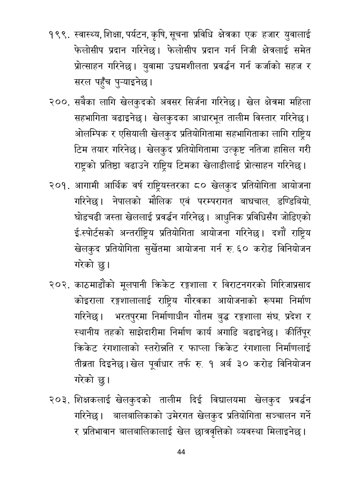

# Page 45 QA

## Rendered page


## Extracted text

```text
१९९, स्वास्थ्य, शिक्षा, पर्यटन, कृषि, सूचना प्रविधि क्षेत्रका एक हजार युवालाई फेलोसीप प्रदान गरिनेछ। फेलोसीप प्रदान गर्न निजी क्षेत्रलाई समेत प्रोत्साहन गरिनेछ। युवामा उद्यमशीलता प्रवर्द्धन गर्न कर्जाको सहज र सरल
पहुँच पुन्याइनेछ।
. सबैका लागि खेलकुदको अवसर सिर्जना गरिनेछ। खेल क्षेत्रमा महिला सहभागिता बढाइनेछ। खेलकुदका आधारभूत तालीम विस्तार गरिनेछ | ओलम्पिक र एसियाली खेलकुद प्रतियोगितामा सहभागिताका लागि राष्ट्रिय टिम तयार गरिनेछ। खेलकुद प्रतियोगितामा उत्कृष्ट नतिजा हासिल गरी राष्ट्रको प्रतिष्ठा बढाउने राष्ट्रिय टिमका खेलाडीलाई प्रोत्साहन गरिनेछ |
आगामी आर्थिक वर्ष राष्ट्रियस्तरका ८० खेलकुद प्रतियोगिता आयोजना गरिनेछ। नेपालको मौलिक एवं परम्परागत बाघचाल, डण्डिबियो, घोडचढी जस्ता खेललाई प्रवर्धन गरिनेछ। आधुनिक प्रविधिसँग जोडिएको ई.स्पोर्टसको अन्तर्राष्ट्रिय प्रतियोगिता आयोजना गरिनेछ। दशौं राष्ट्रिय खेलकुद प्रतियोगिता सुर्खेतमा आयोजना गर्न रु. ६० करोड विनियोजन गरेको छु।
काठमाडौंको मूलपानी क्रिकेट रङ्ग्गाला र विराटनगरको गिरिजाप्रसाद कोइराला रङ्गशालालाई राष्ट्रिय गौरवका आयोजनाको रूपमा निर्माण गरिनेछ। भरतपुरमा निर्माणाधीन गौतम बुद्ध रङ्गशाला संघ, प्रदेश र स्थानीय तहको साझेदारीमा निर्माण कार्य अगाडि बढाइनेछ। कीर्तिपूर क्रिकेट रंगशालाको स्तरोन्नति र फाप्ला क्रिकेट रंगशाला निर्माणलाई तीब्रता दिइनेछ। खेल पूर्वाधार तर्फ रु. १ अर्ब ३० करोड विनियोजन गरेको छु।
. शिक्षकलाई खेलकुदको तालीम दिई विद्यालयमा खेलकुद प्रवर्धन गरिनेछ। बालबालिकाको उमेरगत खेलकुद प्रतियोगिता सञ्चालन गर्ने र प्रतिभावान बालबालिकालाई खेल छात्रवृत्तिको व्यवस्था मिलाइनेछ।
४४
```

## Flags
- None
