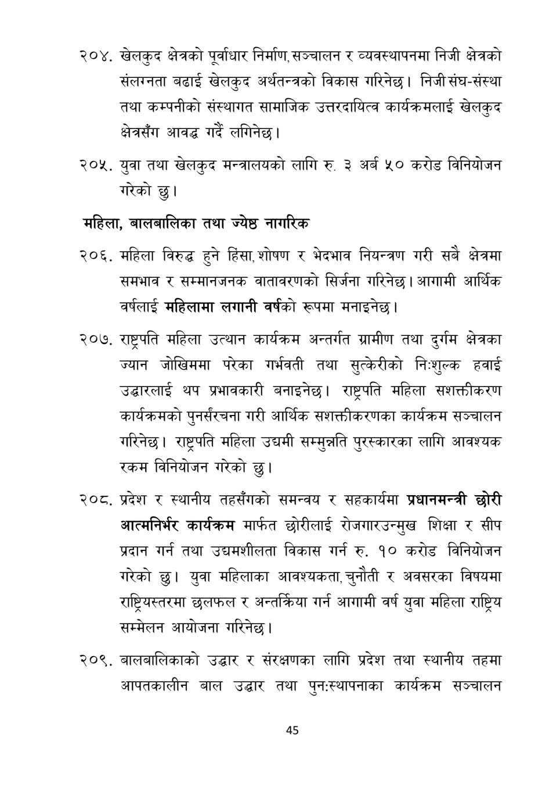

# Page 46 QA

## Rendered page


## Extracted text

```text
२०४, खेलकुद क्षेत्रको पूर्वाधार निर्माण, सञ्चालन र व्यवस्थापनमा निजी क्षेत्रको संलग्नता बढाई खेलकुद अर्थतन्त्रको विकास गरिनेछ। निजी संघ-संस्था तथा कम्पनीको संस्थागत सामाजिक उत्तरदायित्व कार्यक्रमलाई खेलकुद क्षेत्रसँग आवद्ध गर्दै लगिनेछ।
युवा तथा खेलकुद मन्त्रालयको लागि रु. ३ अर्ब ५० करोड विनियोजन गरेको छु।
महिला, बालबालिका तथा ज्येष्ठ नागरिक
महिला विरुद्ध हुने हिंसा, शोषण र भेदभाव नियन्त्रण गरी सबै क्षेत्रमा समभाव र सम्मानजनक वातावरणको सिर्जना गरिनेछ | आगामी आर्थिक वर्षलाई महिलामा लगानी वर्षको रूपमा मनाइनेछ।
. राष्ट्रपति महिला उत्थान कार्यक्रम अन्तर्गत ग्रामीण तथा दुर्गम क्षेत्रका ज्यान जोखिममा परेका गर्भवती तथा सुत्केरीको निःशुल्क हवाई उद्घारलाई थप प्रभावकारी बनाइनेछ। राष्ट्रपति महिला सशक्तीकरण कार्यक्रमको पुनर्संरचना गरी आर्थिक सशक्तीकरणका कार्यक्रम सञ्चालन गरिनेछ। राष्ट्रपति महिला उद्यमी सम्मुन्नति पुरस्कारका लागि आवश्यक रकम विनियोजन गरेको छु।
. प्रदेश र स्थानीय तहसँगको समन्वय र सहकार्यमा प्रधानमन्त्री छोरी आत्मनिर्भर कार्यक्रम मार्फत छोरीलाई रोजगारउन्मुख शिक्षा र सीप प्रदान गर्न तथा उद्यमशीलता विकास गर्न रु. १० करोड विनियोजन गरेको छु। युवा महिलाका आवश्यकता, चुनौती र अवसरका विषयमा राष्ट्रियस्तरमा छलफल र अन्तक्रिया गर्न आगामी वर्ष युवा महिला राष्ट्रिय सम्मेलन आयोजना गरिनेछ।
. बालबालिकाको उद्धार र संरक्षणका लागि प्रदेश तथा स्थानीय तहमा आपतकालीन बाल उद्धार तथा पुनःस्थापनाका कार्यक्रम सञ्चालन
४५
```

## Flags
- None
