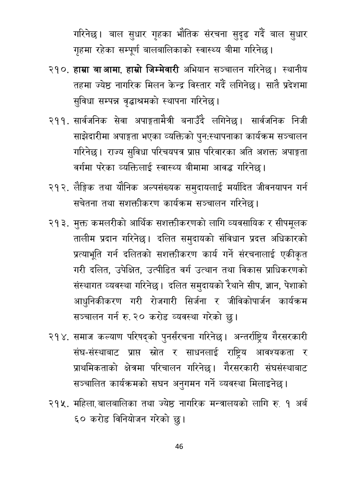

# Page 47 QA

## Rendered page


## Extracted text

```text
गरिनेछ। बाल सुधार गृहका भौतिक संरचना सुदृढ गर्दै बाल सुधार गृहमा रहेका सम्पूर्ण बालबालिकाको स्वास्थ्य बीमा गरिनेछ।
हाम्रा बा आमा, हाम्रो जिम्मेवारी अभियान सञ्चालन गरिनेछ। स्थानीय तहमा ज्येष्ठ नागरिक मिलन केन्द्र विस्तार गर्दै लगिनेछ। सातै प्रदेशमा सुविधा सम्पन्न वृद्धाश्रमको स्थापना गरिनेछ |
सार्वजनिक सेवा अपाङ्गतामैत्री बनाउँदै लगिनेछ। सार्वजनिक निजी साझेदारीमा अपाङ्गता भएका व्यक्तिको पुनःस्थापनाका कार्यक्रम सञ्चालन गरिनेछ। राज्य सुविधा परिचयपत्र प्राप्त परिवारका अति अशक्त अपाङ्गता वर्गमा परेका व्यक्तिलाई स्वास्थ्य बीमामा आवद्ध गरिनेछ |
लैङ्गिक तथा यौनिक अल्पसंख्यक समुदायलाई मर्यादित जीवनयापन गर्न सचेतना तथा सशक्तीकरण कार्यक्रम सञ्चालन गरिनेछ |
मुक्त कमलरीको आर्थिक सशक्तीकरणको लागि व्यवसायिक र सीपमूलक तालीम प्रदान गरिनेछ। दलित समुदायको संविधान प्रदत्त अधिकारको प्रत्याभूति गर्न दलितको सशक्तीकरण कार्य गर्ने संरचनालाई एकीकृत गरी दलित, उपेक्षित, उत्पीडित वर्ग उत्थान तथा विकास प्राधिकरणको संस्थागत व्यवस्था गरिनेछ। दलित समुदायको रैथाने सीप, ज्ञान, पेशाको आधुनिकीकरण गरी रोजगारी सिर्जना र जीविकोपार्जन कार्यक्रम सञ्चालन गर्न रु. २० करोड व्यवस्था गरेको छु।
समाज कल्याण परिषद्को पुनर्संरचना गरिनेछु। अन्तर्राष्ट्रिय गैरसरकारी संघ-संस्थाबाट प्रापत स्रोत र साधनलाई राष्ट्रिय आवश्यकता र प्राथमिकताको क्षेत्रमा परिचालन गरिनेछ। गैरसरकारी संघसंस्थाबाट सञ्चालित कार्यक्रमको सघन अनुगमन गर्ने व्यवस्था मिलाइनेछ |
. महिला, बालबालिका तथा ज्येष्ठ नागरिक मन्त्रालयको लागि रु. १ अर्ब ६० करोड विनियोजन गरेको छु।
४६
```

## Flags
- None
