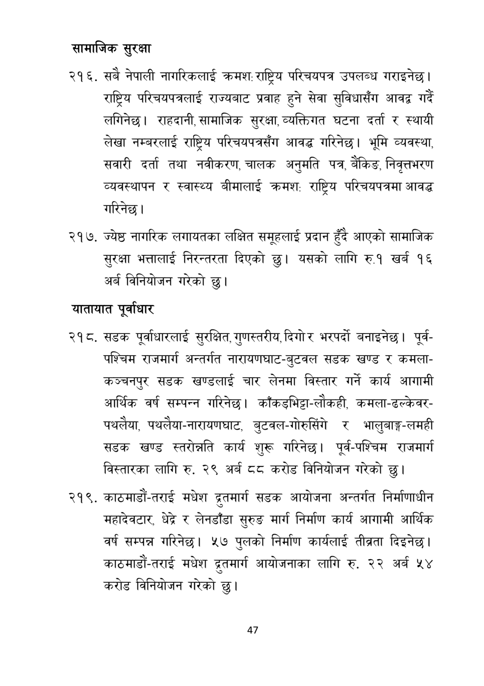

# Page 48 QA

## Rendered page


## Extracted text

```text
सामाजिक सुरक्षा
सबै नेपाली नागरिकलाई क्रमश:राष्ट्रिय परिचयपत्र उपलब्ध गराइनेछ | राष्ट्रिय परिचयपत्रलाई राज्यबाट प्रवाह हुने सेवा सुविधासँग गर्दै लगिनेछ। राहदानी, सामाजिक सुरक्षा, व्यक्तिगत घटना दर्ता र स्थायी लेखा नम्बरलाई राष्ट्रिय परिचयपत्रसँग आवद्ध गरिनेछ। भूमि व्यवस्था, सवारी दर्ता तथा नवीकरण, चालक अनुमति पत्र, बैंकिङ, निवृत्तभरण व्यवस्थापन र स्वास्थ्य बीमालाई क्रमश: राष्ट्रिय परिचयपत्रमा आवद्ध गरिनेछ।
ज्येष्ठ नागरिक लगायतका लक्षित समूहलाई प्रदान हुँदै आएको सामाजिक सुरक्षा भत्तालाई निरन्तरता दिएको छु। यसको लागि रु.१ खर्ब १६ अर्ब विनियोजन गरेको छु।
यातायात पूर्वाधार
सडक पूर्वाधारलाई सुरक्षित, गुणस्तरीय, दिगो र भरपर्दो बनाइनेछ। पूर्वपश्चिम राजमार्ग अन्तर्गत नारायणघाट-बुटवल सडक खण्ड र कमलाकञ्चनपुर सडक खण्डलाई चार लेनमा विस्तार गर्ने कार्य आगामी आर्थिक वर्ष सम्पन्न गरिनेछ। काँकडभिट्टा-लौकही, कमला-ढल्केवरपथलैया, पथलैया-नारायणघाट, बुटवल-गोरुसिंगे र भालुबाङ्ग-लमही सडक खण्ड स्तरोन्नति कार्य शुरू गरिनेछ। पूर्व-पश्चिम राजमार्ग विस्तारका लागि रु. २९ अर्ब ५ करोड विनियोजन गरेको |
. काठमाडौं-तराई मधेश द्रतमार्ग सडक आयोजना अन्तर्गत निर्माणाधीन महादेवटार, % लेनडाँडा सुरुङ मार्ग निर्माण कार्य आगामी आर्थिक वर्ष सम्पन्न गरिनेछ। ५७ पुलको निर्माण कार्यलाई तीब्रता दिइनेछ | काठमाडौं-तराई मधेश द्रतमार्ग आयोजनाका लागि रु. २२ अर्ब ५४ करोड विनियोजन गरेको छु।
४७
```

## Flags
- None
