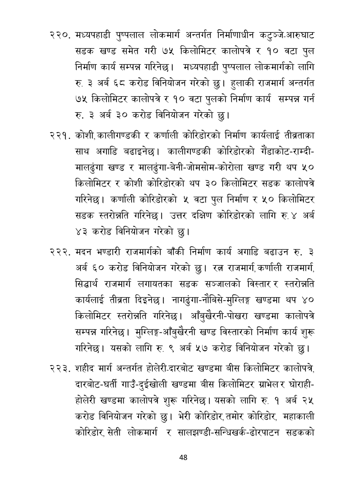

# Page 49 QA

## Rendered page


## Extracted text

```text
मध्यपहाडी पुष्पलाल लोकमार्ग अन्तर्गत निर्माणाधीन कटुञ्जे-आरुघाट सडक खण्ड समेत गरी ७५ किलोमिटर कालोपत्रे र १० वटा पुल निर्माण कार्य सम्पन्न गरिनेछ। मध्यपहाडी पुष्पलाल लोकमार्गको लागि रु. ३ अर्ब ६८ करोड विनियोजन गरेको छु। हुलाकी राजमार्ग अन्तर्गत ७५ किलोमिटर कालोपत्रे र १० वटा पुलको निर्माण कार्य सम्पन्न गर्न रु. ३ अर्ब ३० करोड विनियोजन गरेको
छु।
कोशी, कालीगण्डकी र कर्णाली कोरिडोरको निर्माण कार्यलाई तीव्रताका साथ अगाडि बढाइनेछ। कालीगण्डकी कोरिडोरको गैंडाकोट-राम्दीमालढुंगा खण्ड र मालढुंगा-बेनी-जोमसोम-कोरोला खण्ड गरी थप ५० किलोमिटर र कोशी कोरिडोरको थप ३० किलोमिटर सडक कालोपत्रे गरिनेछ। कर्णाली कोरिडोरको ५ वटा पुल निर्माण र ५० किलोमिटर सडक स्तरोन्नति गरिनेछ। उत्तर दक्षिण कोरिडोरको लागि रु. ४ अर्ब ४३ करोड विनियोजन गरेको छु।
२२२ ). मदन भण्डारी राजमार्गको बाँकी निर्माण कार्य अगाडि बढाउन रु. ३ अर्ब ६० करोड विनियोजन गरेको | रत्न राजमार्ग, कर्णाली राजमार्ग, सिद्धार्थ राजमार्ग लगायतका सडक सञ्जालको विस्तार र स्तरोन्नति कार्यलाई तीब्रता दिइनेछ। नागर्ढुंगा-नौबिसे-मुग्लिङ्ग खण्डमा थप ४० किलोमिटर स्तरोन्नति गरिनेछ। आँबुखेरनी-पोखरा खण्डमा कालोपत्रे सम्पन्न गरिनेछ। मुग्लिङ्ग-आँबुखैरनी खण्ड विस्तारको निर्माण कार्य शुरू गरिनेछ। यसको लागि रु. ९ अर्ब ५७ करोड विनियोजन गरेको छु।
शहीद मार्ग अन्तर्गत होलेरी-दारबोट खण्डमा बीस किलोमिटर कालोपत्रे, दारबोट-घर्ती गाउँ-दुईखोली खण्डमा बीस किलोमिटर ग्राभेलर घोराहीहोलेरी खण्डमा कालोपत्रै शुरू गरिनेछ। यसको लागि रु. १ अर्ब २५ करोड विनियोजन गरेको छु। भेरी कोरिडोर, तमोर कोरिडोर, महाकाली कोरिडोर, सेती लोकमार्ग र सालझण्डी-सन्धिखर्क-ढोरपाटन सडकको
४८
```

## Flags
- None
