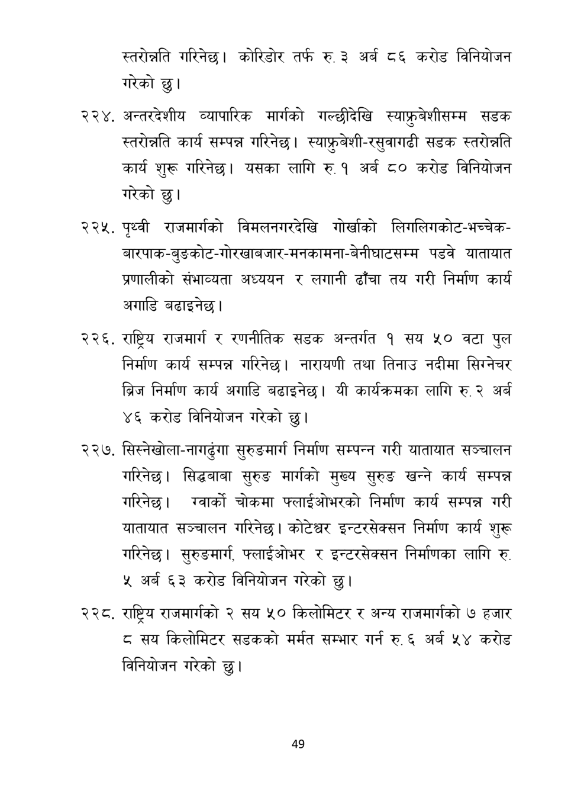

# Page 50 QA

## Rendered page


## Extracted text

```text
स्तरोन्नति गरिनेछ। कोरिडोर तर्फ रु. ३ अर्ब ८६ करोड विनियोजन गरेको छु।
अन्तरदेशीय व्यापारिक मार्गको गल्छीदेखि स्याफ्रबेशीसम्म सडक स्तरोन्नति कार्य सम्पन्न गरिनेछ। स्याफ्रुबेशी-रसुवागढी सडक स्तरोन्नति कार्य शुरू गरिनेछ। यसका लागि € १ अर्ब ८० करोड विनियोजन गरेको छु।
पृथ्वी राजमार्गको विमलनगरदेखि गोर्खाको लिगलिगकोट-भच्चेकबारपाक-बुङकोट-गोरखाबजार-मनकामना-बेनीघाटसम्म पडवे यातायात प्रणालीको संभाव्यता अध्ययन र लगानी ढाँचा तय गरी निर्माण कार्य अगाडि बढाइनेछ |
. राष्ट्रिय राजमार्ग र रणनीतिक सडक अन्तर्गत १ सय ५० वटा पुल निर्माण कार्य सम्पन्न गरिनेछ। नारायणी तथा तिनाउ नदीमा सिग्नेचर ब्रिज निर्माण कार्य अगाडि बढाइनेछ। यी कार्यक्रमका लागि रु. २ अर्ब ४६ करोड विनियोजन गरेको छु।
सिस्नेखोला-नागढुंगा सुरुङमार्ग निर्माण सम्पन्न गरी यातायात सञ्चालन गरिनेछ। सिद्धबाबा सुरुङ मार्गको मुख्य सुरुङ खन्ने कार्य सम्पन्न गरिनेछ। ग्वार्को चोकमा फ्लाईओभरको निर्माण कार्य सम्पन्न गरी यातायात सञ्चालन गरिनेछ। कोटेश्वर इन्टरसेक्सन निर्माण कार्य शुरू गरिनेछ। सुरुङमार्ग फ्लाईओभर र इन्टरसेक्सन निर्माणका लागि रु. ५ अर्ब ६३ करोड विनियोजन गरेको छु।
राष्ट्रिय राजमार्गको २ सय ५० किलोमिटर र अन्य राजमार्गको ७ हजार ८ सय किलोमिटर सडकको मर्मत सम्भार गर्न रु. ६ अर्ब ५४ करोड विनियोजन गरेको छु।
४९
```

## Flags
- None
