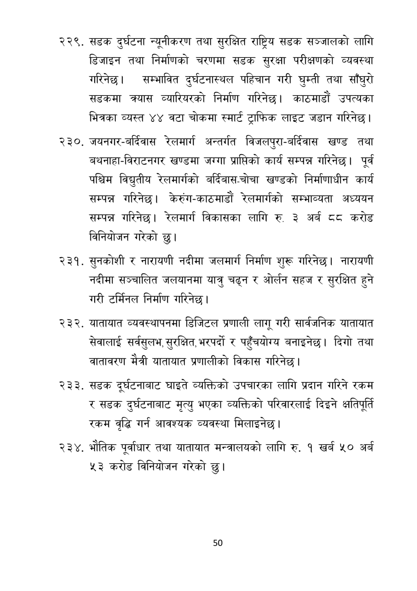

# Page 51 QA

## Rendered page


## Extracted text

```text
सडक दुर्घटना न्यूनीकरण तथा सुरक्षित राष्ट्रिय सडक सञ्जालको लागि डिजाइन तथा निर्माणको चरणमा सडक सुरक्षा परीक्षणको व्यवस्था गरिनेछ। सम्भावित दुर्घटनास्थल पहिचान गरी घुम्ती तथा साँघुरो सडकमा क्र्यास व्यारियरको निर्माण गरिनेछ। काठमाडौं उपत्यका भित्रका व्यस्त ४४ वटा चोकमा स्मार्ट ट्राफिक लाइट जडान गरिनेछ |
जयनगर-बर्दिवास रेलमार्ग अन्तर्गत विजलपुरा-बर्दिवास खण्ड तथा बथनाहा-विराटनगर खण्डमा जग्गा प्राप्तिको कार्य सम्पन्न गरिनेछ। पूर्व पश्चिम विद्युतीय रेलमार्गको बर्दिबास-चोचा खण्डको निर्माणाधीन कार्य सम्पन्न गरिनेछ। केरुंग-काठमाडौं रेलमार्गको सम्भाव्यता अध्ययन सम्पन्न गरिनेछ। रेलमार्ग विकासका लागि रु. ३ अर्ब करोड विनियोजन गरेको छु।
सुनकोशी र नारायणी नदीमा जलमार्ग निर्माण शुरू गरिनेछ। नारायणी नदीमा सञ्चालित जलयानमा यात्रु चढ्न र ओर्लन सहज र सुरक्षित हुने गरी टर्मिनल निर्माण गरिनेछ |
यातायात व्यवस्थापनमा डिजिटल प्रणाली लागू गरी सार्वजनिक यातायात सेवालाई सर्वसुलभ, सुरक्षित, भरपर्दो र पहुँचयोग्य बनाइनेछ। दिगो तथा वातावरण मैत्री यातायात प्रणालीको विकास गरिनेछ |
सडक दुर्घटनाबाट घाइते व्यक्तिको उपचारका लागि प्रदान गरिने रकम र सडक दुर्घटनाबाट मृत्यु भएका व्यक्तिको परिवारलाई दिइने क्षतिपूर्ति रकम वृद्धि गर्न आवश्यक व्यवस्था मिलाइनेछ।
भौतिक पूर्वाधार तथा यातायात मन्त्रालयको लागि रु. १ खर्ब ५० अर्ब ५३ करोड विनियोजन गरेको छु।
५०
```

## Flags
- None
