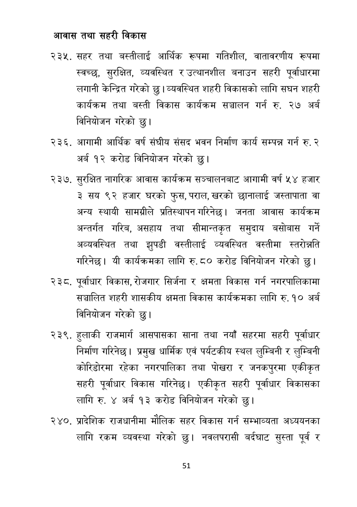

# Page 52 QA

## Rendered page


## Extracted text

```text
आवास तथा सहरी विकास
सहर तथा बस्तीलाई आर्थिक रूपमा गतिशील, वातावरणीय रूपमा स्वच्छ, सुरक्षित, व्यवस्थित र उत्थानशील बनाउन सहरी पूर्वाधारमा लगानी केन्द्रित गरेको छु। व्यवस्थित शहरी विकासको लागि सघन शहरी कार्यक्रम तथा बस्ती विकास कार्यक्रम सञ्चालन गर्न रु. २७ अर्ब विनियोजन गरेको छु।
आगामी आर्थिक वर्ष संघीय संसद भवन निर्माण कार्य सम्पन्न गर्न रु. २ अर्ब १२ करोड विनियोजन गरेको छु।
सुरक्षित नागरिक आवास कार्यक्रम सञ्चालनबाट आगामी वर्ष ५४ हजार ३ सय ९२ हजार घरको फुस, पराल, खरको छानालाई जस्तापाता वा अन्य स्थायी सामग्रीले प्रतिस्थापन गरिनेछ। जनता आवास कार्यक्रम अन्तर्गत गरिब, असहाय तथा सीमान्तकृत समुदाय बसोबास गर्ने अव्यवस्थित तथा झुपडी वस्तीलाई व्यवस्थित वस्तीमा स्तरोन्नति गरिनेछ। यी कार्यक्रमका लागि रु. ८० करोड विनियोजन गरेको छु।
पूर्वाधार विकास, रोजगार सिर्जना र क्षमता विकास गर्न नगरपालिकामा सञ्चालित शहरी शासकीय क्षमता विकास कार्यक्रमका लागि रु. १० अर्ब विनियोजन गरेको छु।
हुलाकी राजमार्ग आसपासका साना तथा नयाँ सहरमा सहरी पूर्वाधार निर्माण गरिनेछ। प्रमुख धार्मिक एवं पर्यटकीय स्थल लुम्बिनी र लुम्बिनी कोरिडोरमा रहेका नगरपालिका तथा पोखरा र जनकपुरमा एकीकृत सहरी पूर्वाधार विकास गरिनेछ। एकीकृत सहरी पूर्वाधार विकासका लागि रु. ४ अर्ब १३ करोड विनियोजन गरेको छु।
. प्रादेशिक राजधानीमा मौलिक सहर विकास गर्न सम्भाव्यता अध्ययनका लागि रकम व्यवस्था गरेको छु। नवलपरासी बर्दघाट सुस्ता पूर्व र
५१
```

## Flags
- None
